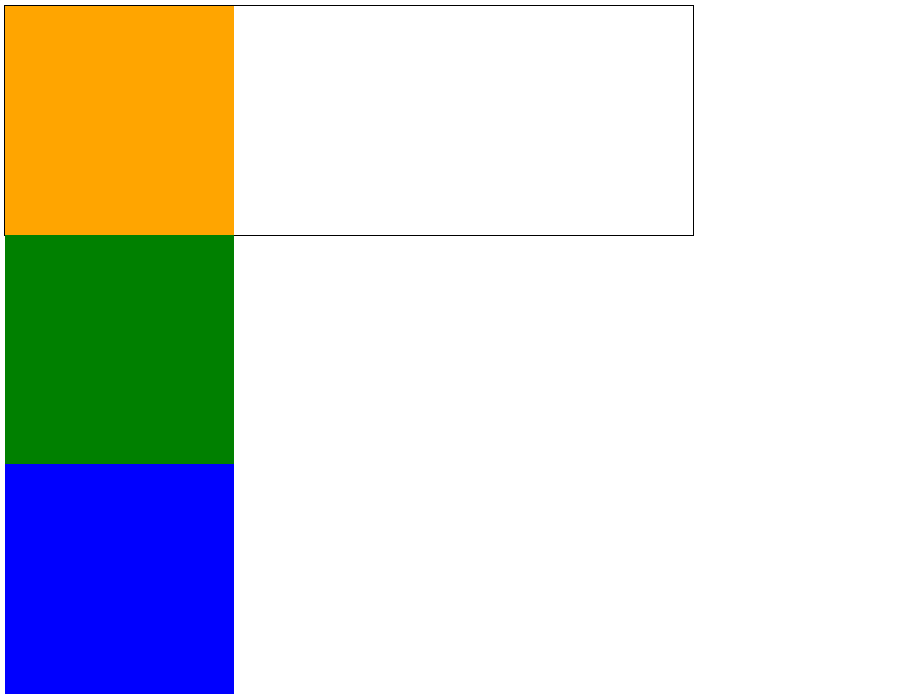
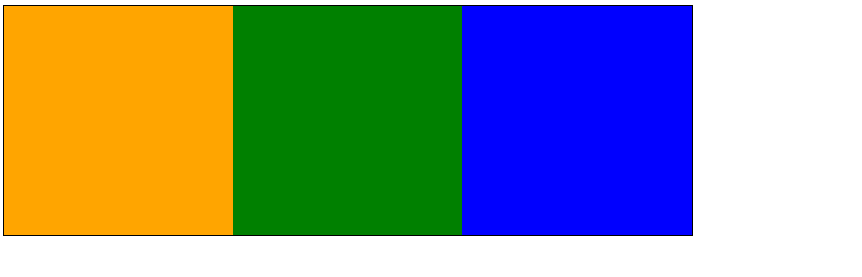
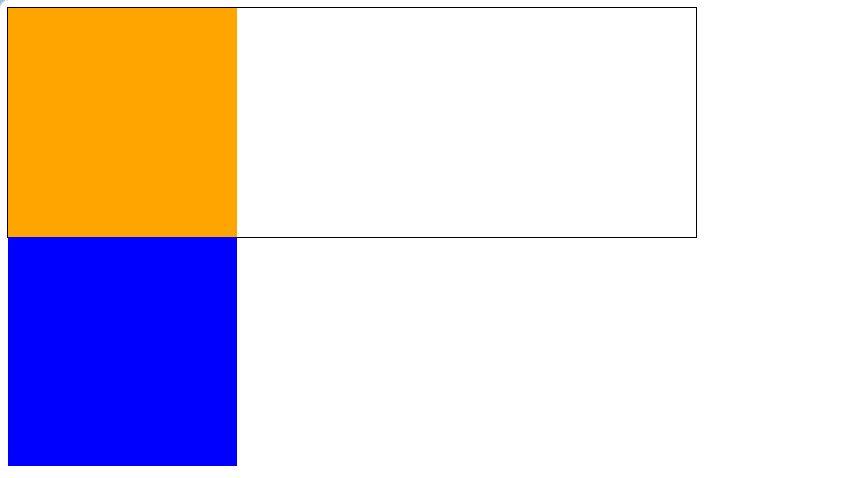
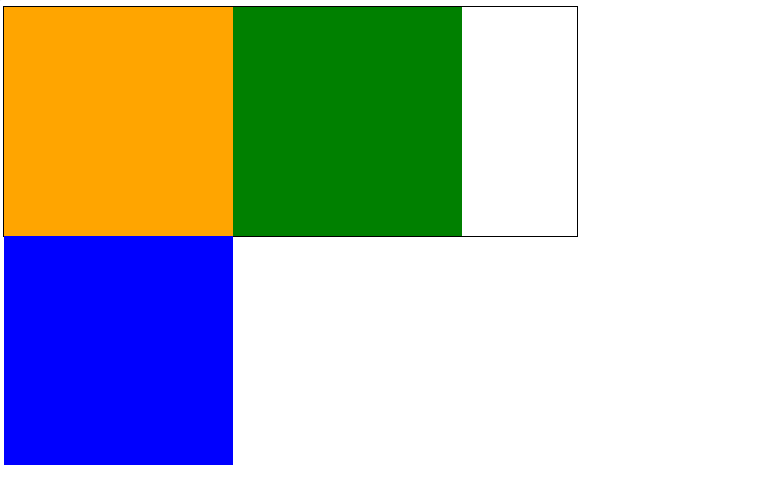
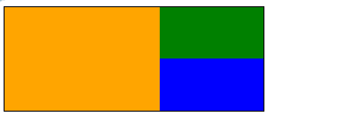
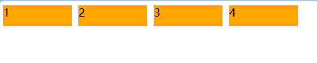

+++
title = 'CSS 浮动'
date = 2024-05-23T18:22:30Z
draft = false
+++

## 先谈谈浮动 float

很多网站的布局都是通过 float 实现的，浮动最本质的功能就是用来实现并排。

### 一个例子
先来看一个例子，有三个未设置浮动的盒子，代码如下：
```html
<!DOCTYPE html>
<html lang="en">
  <head>
    <meta charset="UTF-8" />
    <meta name="viewport" content="width=device-width, initial-scale=1.0" />
    <title>Document</title>
    <style>
      .box {
        width: 600px;
        height: 200px;
        border: 1px solid #000;
      }
      .box .c1 {
        width: 200px;
        height: 200px;
        background-color: orange;
        /* float: left; */
      }
      .box .c2 {
        width: 200px;
        height: 200px;
        background-color: green;
        /* float: left; */
      }
      .box .c3 {
        width: 200px;
        height: 200px;
        background-color: blue;
        /* float: left; */
      }
    </style>
  </head>
  <body>
    <div class="box">
      <div class="c1"></div>
      <div class="c2"></div>
      <div class="c3"></div>
    </div>
  </body>
</html>


```


当我们给三个盒子都设置浮动，即取消上面代码注释部分，盒子便可以横向编排。


### 浮动使用要点

浮动在使用时，有两个要点
1. 要浮动，并排的盒子都要设置浮动
2. 父盒子要有足够的宽度，否则子盒子会掉下去

现在假设只有 c1 设置浮动，则
```html
    <style>
      .box {
        width: 600px;
        height: 200px;
        border: 1px solid #000;
      }
      .box .c1 {
        width: 200px;
        height: 200px;
        background-color: orange;
        float: left;
      }
      .box .c2 {
        width: 200px;
        height: 200px;
        background-color: green;
        /* float: left; */
      }
      .box .c3 {
        width: 200px;
        height: 200px;
        background-color: blue;
        /* float: left; */
      }
    </style>

```


假设父盒子只有 500 px,则：
```html
    <style>
      .box {
        width: 500px;
        height: 200px;
        border: 1px solid #000;
      }
      .box .c1 {
        width: 200px;
        height: 200px;
        background-color: orange;
        float: left;
      }
      .box .c2 {
        width: 200px;
        height: 200px;
        background-color: green;
        float: left;
      }
      .box .c3 {
        width: 200px;
        height: 200px;
        background-color: blue;
        float: left;
      }

```



### 浮动的贴靠特性

子盒子按顺序进行贴靠，如果没有足够空间，才会往前寻找前一个兄弟元素。

比如：
```html
 .box {
        width: 250px;
        height: 100px;
        border: 1px solid #000;
      }
      .box .c1 {
        width: 150px;
        height: 100px;
        background-color: orange;
        float: left;
      }
      .box .c2 {
        width: 100px;
        height: 50px;
        background-color: green;
        float: left;
      }
      .box .c3 {
        width: 100px;
        height: 50px;
        background-color: blue;
        float: left;
      }

```


### 浮动一定能设置宽高

```html
<!DOCTYPE html>
<html lang="en">

<head>
    <meta charset="UTF-8">
    <meta name="viewport" content="width=device-width, initial-scale=1.0">
    <title>Document</title>
    <style>
        span {
            float: left;
            width: 100px;
            height: 30px;
            background-color: orange;
            margin-right: 10px;
        }
    </style>
</head>

<body>
    <span>1</span>
    <span>2</span>
    <span>3</span>
    <span>4</span>
</body>

</html>

```
