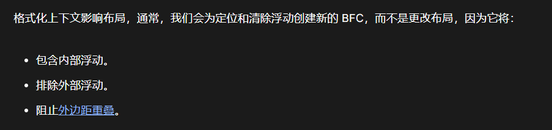
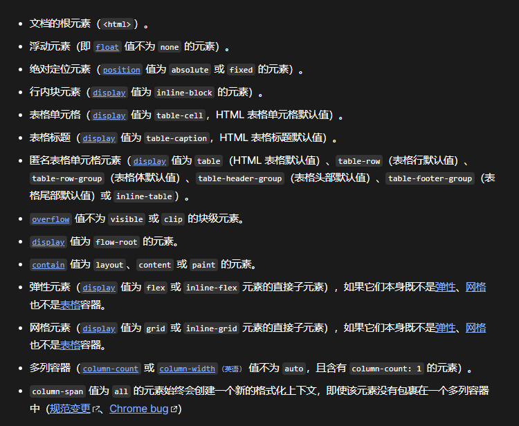
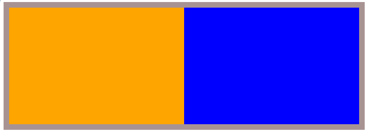
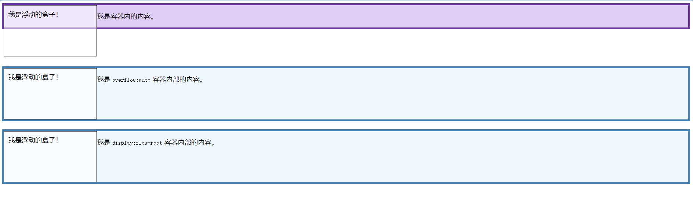
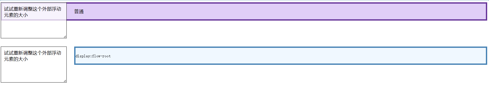
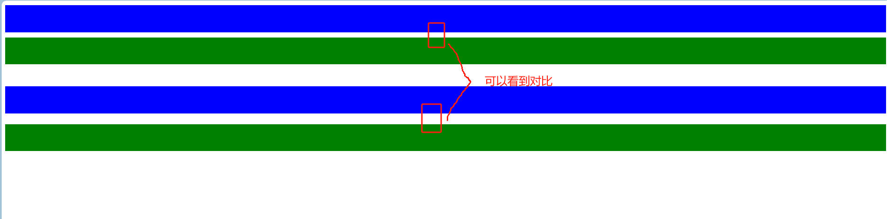

+++
title = 'CSS清除浮动'
date = 2024-05-28T08:50:13Z
draft = false
+++

## 谈谈 BFC

当一个盒子没有设置 height, 而子盒子又都设置浮动时，此时这个盒子会塌陷。
如下：
```html
<!DOCTYPE html>
<html lang="en">
  <head>
    <meta charset="UTF-8" />
    <meta name="viewport" content="width=device-width, initial-scale=1.0" />
    <title>Document</title>
    <style>
      .box {
        width: 600px;
        border: 10px solid #a89393;
      }
      .box .c1 {
        width: 300px;
        height: 200px;
        background-color: orange;
        float: left;
      }
      .box .c2 {
        width: 300px;
        height: 200px;
        background-color: blue;
        float: left;
      }
    </style>
  </head>
  <body>
    <div class="box">
      <div class="c1"></div>
      <div class="c2"></div>
    </div>
  </body>
</html>


```


造成这个现象的原因，就是这个父盒子没有产生 BFC。

## 那么什么是 BFC 呢 ？

根据 MDN 的定义，BFC(区块格式化上下文)是 Web 页面的可视 CSS 渲染的一部分，是块级盒子的布局过程发生的区域，也是浮动元素与其他元素交互的区域。


下列方式会创建块格式化上下文：



本质上来说，只要创建了 BFC,浮动的问题就解决了。

下面是一些清除浮动的示例：

### 给父级元素加一个合适的高度

这个不用多说了吧？问题怎么产生的就怎么解决。

但这个方法中用得比较少，因为能被内容撑高，所以网页制作中，高度height其实很少出现。

```html
    <style>
      .box {
        width: 600px;
        border: 10px solid #a89393;
        height: 200px;
      }
      .box .c1 {
        width: 300px;
        height: 200px;
        background-color: orange;
        float: left;
      }
      .box .c2 {
        width: 300px;
        height: 200px;
        background-color: blue;
        float: left;
      }
    </style>

```


### clear both
```html
<!DOCTYPE html>
<html lang="en">
  <head>
    <meta charset="UTF-8" />
    <meta name="viewport" content="width=device-width, initial-scale=1.0" />
    <title>Document</title>
    <style>
      .box {
        width: 600px;
        border: 10px solid #a89393;
      }
      .box .c1 {
        width: 300px;
        height: 200px;
        background-color: orange;
        float: left;
      }
      .box .c2 {
        width: 300px;
        height: 200px;
        background-color: blue;
        float: left;
      }

      .cl {
        clear: both;
      }
    </style>
  </head>
  <body>
    <div class="box">
      <div class="c1"></div>
      <div class="c2"></div>
      <div class="cl"></div>
    </div>
  </body>
</html>


```

插入一个类为 .cl 空div标签，让父盒子可以实现内容包裹。

### overflow hidden
```html

<!DOCTYPE html>
<html lang="en">
  <head>
    <meta charset="UTF-8" />
    <meta name="viewport" content="width=device-width, initial-scale=1.0" />
    <title>Document</title>
    <style>
      .box {
        width: 600px;
        border: 10px solid #a89393;
        overflow: hidden;
      }
      .box .c1 {
        width: 300px;
        height: 200px;
        background-color: orange;
        float: left;
      }
      .box .c2 {
        width: 300px;
        height: 200px;
        background-color: blue;
        float: left;
      }


    </style>
  </head>
  <body>
    <div class="box">
      <div class="c1"></div>
      <div class="c2"></div>
    </div>
  </body>
</html>


```

### MDN 上的示例

#### 内部浮动示例
```html
<!DOCTYPE html>
<html lang="en">
  <head>
    <meta charset="UTF-8" />
    <meta name="viewport" content="width=device-width, initial-scale=1.0" />
    <title>Document</title>
    <style>
      section {
        height: 150px;
      }
      .box {
        background-color: rgb(224, 206, 247);
        border: 5px solid rebeccapurple;
      }
      .box[style] {
        background-color: aliceblue;
        border: 5px solid steelblue;
      }
      .float {
        float: left;
        width: 200px;
        height: 100px;
        background-color: rgba(255, 255, 255, 0.5);
        border: 1px solid black;
        padding: 10px;
      }
    </style>
  </head>
  <body>
    <section>
      <div class="box">
        <div class="float">我是浮动的盒子！</div>
        <p>我是容器内的内容。</p>
      </div>
    </section>
    <section>
      <div class="box" style="overflow: auto">
        <div class="float">我是浮动的盒子！</div>
        <p>我是 <code>overflow:auto</code> 容器内部的内容。</p>
      </div>
    </section>
    <section>
      <div class="box" style="display: flow-root">
        <div class="float">我是浮动的盒子！</div>
        <p>我是 <code>display:flow-root</code> 容器内部的内容。</p>
      </div>
    </section>
  </body>
</html>


```




#### 排除外部浮动
```html
<!DOCTYPE html>
<html lang="en">
  <head>
    <meta charset="UTF-8" />
    <meta name="viewport" content="width=device-width, initial-scale=1.0" />
    <title>Document</title>
    <style>
      section {
        height: 150px;
      }
      .box {
        background-color: rgb(224, 206, 247);
        border: 5px solid rebeccapurple;
      }
      .box[style] {
        background-color: aliceblue;
        border: 5px solid steelblue;
      }
      .float {
        float: left;
        overflow: hidden; /* resize:both 所必需的样式 */
        resize: both;
        margin-right: 25px;
        width: 200px;
        height: 100px;
        background-color: rgba(255, 255, 255, 0.75);
        border: 1px solid black;
        padding: 10px;
      }
    </style>
  </head>
  <body>
    <section>
      <div class="float">试试重新调整这个外部浮动元素的大小</div>
      <div class="box"><p>普通</p></div>
    </section>
    <section>
      <div class="float">试试重新调整这个外部浮动元素的大小</div>
      <div class="box" style="display: flow-root">
        <p><code>display:flow-root</code></p>
        <p></p>
      </div>
    </section>
  </body>
</html>


```




#### 防止外边距重叠
```html
<!DOCTYPE html>
<html lang="en">
  <head>
    <meta charset="UTF-8" />
    <meta name="viewport" content="width=device-width, initial-scale=1.0" />
    <title>Document</title>
    <style>
      .blue,
      .green {
        height: 50px;
        margin: 10px 0;
      }

      .blue {
        background: blue;
      }

      .green {
        background: green;
      }

      .outer {
        overflow: hidden;
        background: transparent;
      }
    </style>
  </head>
  <body>
    <div class="blue"></div>
    <div class="green"></div>

    <br />

    <div class="blue"></div>
    <div class="outer">
      <div class="green"></div>
    </div>
  </body>
</html>


```


