+++
title = 'Explain详解与索引最佳实践'
date = 2024-05-30T06:44:34Z
draft = true
+++

## Explain 

Explain是MySQL中的一个非常有用的工具，它可以帮助我们理解MySQL是如何执行SQL查询的。

通过使用Explain，我们可以看到查询的执行计划，包括使用了哪些索引，表的连接顺序，预计要扫描的行数等信息。

这些信息可以帮助我们优化查询，提高查询效率。

```sql
EXPLAIN SELECT * FROM users WHERE id = 1;
```

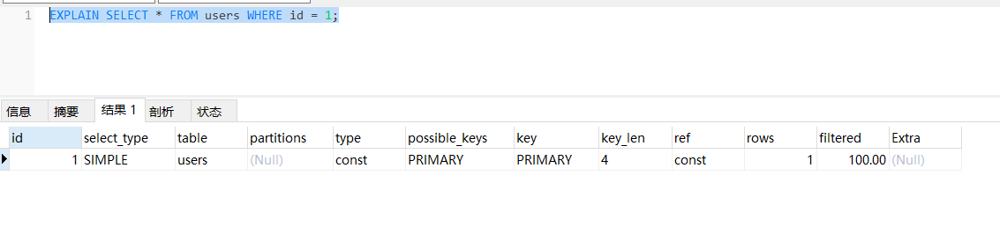
Explain的结果包含以下几个重要的列：
### id
查询的标识符，如果一个查询包含多个子查询，那么每个子查询都会有一个不同的id。
### select_type
表示对应行是简单还是复杂的查询。
  * simple：简单查询。查询不包含子查询和union
  * primary：复杂查询中最外层的 select
  * subquery：包含在 select 中的子查询（不在 from 子句中）
  * derived：包含在 from 子句中的子查询。MySQL会将结果存放在一个临时表中，也称为派生表（derived的英文含义）

```sql
CREATE TABLE customers (
    id INT PRIMARY KEY,
    name VARCHAR(50)
);

CREATE TABLE orders (
    id INT PRIMARY KEY,
    customer_id INT,
    amount DECIMAL(10, 2)
);
INSERT INTO customers (id, name) VALUES 
(1, 'John'),
(2, 'Jane'),
(3, 'Bob');

INSERT INTO orders (id, customer_id, amount) VALUES 
(1, 1, 100.00),
(2, 1, 200.00),
(3, 2, 300.00),
(4, 3, 400.00),
(5, 3, 500.00);
```
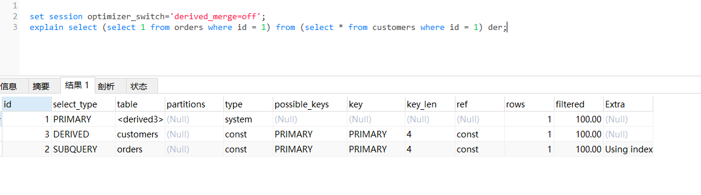

### table
查询涉及到的表。
### type

访问类型，表示MySQL如何访问表

依次从最优到最差分别为：system > const > eq_ref > ref > range > index > ALL

一般来说，得保证查询达到range级别，最好达到ref

**const, system**：MySQL能对查询的某部分进行优化并将其转化成一个常量（可以看show warnings 的结果）。用于 primary key 或 unique key 的所有列与常数比较时，所以表最多有一个匹配行，读取1次，速度比较快。system是const的特例，表里只有一条元组匹配时为system

**eq_ref**

primary key 或 unique key 索引的所有部分被连接使用 ，最多只会返回一条符合条件的记录。这可能是在 const 之外最好的联接类型了，简单的 select 查询不会出现这种 type。

**ref**

相比 eq_ref，不使用唯一索引，而是使用普通索引或者唯一性索引的部分前缀，索引要和某个值相比较，可能会找到多个符合条件的行。

**range**
范围扫描通常出现在 in(), between ,> ,<, >= 等操作中。使用一个索引来检索给定范围的行。

**index**
表示进行了全索引扫描，也就是说，MySQL扫描了整个索引来查找匹配的行。这通常比全表扫描要好，因为索引通常比整个表要小，所以扫描起来更快。然而，如果索引很大，或者匹配的行很多，那么这种类型可能并不比其他类型要好。

**ALL**
即全表扫描，扫描你的聚簇索引的所有叶子节点。通常情况下这需要增加索引来进行优化了。


### possible_keys

可能使用的索引。

### key
实际使用的索引。

### key_len

使用的索引的长度。


### ref
索引的参考列，表示通过哪些列或常量来查找索引。

### rows
预计要扫描的行数。


### partition
这个字段显示了查询涉及的分区信息。如果你的表没有使用分区，那么这个字段的值就会是NULL。如果你的查询只涉及到表的某个分区，那么这个字段就会显示那个分区的名字。如果你的查询涉及到表的多个分区，那么这个字段就会显示为多个分区的名字，用逗号分隔。

### filtered 

是一个半分比的值，rows * filtered/100 可以估算出将要和 explain 中前一个表进行连接的行数

### Extra

额外的信息，例如是否使用了文件排序，是否使用了临时表等。

**Using where**

这表示MySQL服务器将在存储引擎检索行后再进行过滤。这意味着存储引擎返回的行并不都符合WHERE子句的条件。

**Using temporary**

这表示MySQL需要使用一个临时表来存储结果，这通常发生在对不同的列进行ORDER BY和GROUP BY的时候。


**Using filesort**

这表示MySQL会对结果使用一个外部索引排序，而不是按照表内的索引顺序进行读取。需要注意的是，尽管名称是filesort，但并不一定会进行磁盘操作，数据可能会被放在内存中排序，只有在数据量大于内存时，才会使用磁盘。

**Using index**

这表示MySQL使用覆盖索引

覆盖索引定义：MySQL执行计划explain结果里的key有使用索引，如果select后面查询的字段都可以从这个索引的树中获取，这种情况一般可以说是用到了覆盖索引，extra里一般都有using index；覆盖索引一般针对的是辅助索引，整个查询结果只通过辅助索引就能拿到结果，不需要通过辅助索引树找到主键，再通过主键去主键索引树里获取其它字段值

**Using index condition**

查询的列不完全被索引覆盖，where条件中是一个前导列的范围；

**Using join buffer**

这表示MySQL在进行表连接时使用了连接缓冲区。

## 索引最佳实践

示例表：
```sql
CREATE TABLE `employees` (
  `id` int(11) NOT NULL AUTO_INCREMENT,
  `name` varchar(24) NOT NULL DEFAULT '' COMMENT '姓名',
  `age` int(11) NOT NULL DEFAULT '0' COMMENT '年龄',
  `position` varchar(20) NOT NULL DEFAULT '' COMMENT '职位',
  `hire_time` timestamp NOT NULL DEFAULT CURRENT_TIMESTAMP COMMENT '入职时间',
  PRIMARY KEY (`id`),
  KEY `idx_name_age_position` (`name`,`age`,`position`) USING BTREE
) ENGINE=InnoDB AUTO_INCREMENT=4 DEFAULT CHARSET=utf8 COMMENT='员工记录表';

INSERT INTO employees(name,age,position,hire_time) VALUES('LiLei',22,'manager',NOW());
INSERT INTO employees(name,age,position,hire_time) VALUES('HanMeimei', 23,'dev',NOW());
INSERT INTO employees(name,age,position,hire_time) VALUES('Lucy',23,'dev',NOW());
```
### 1.全值匹配
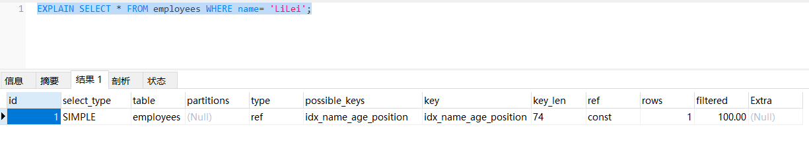

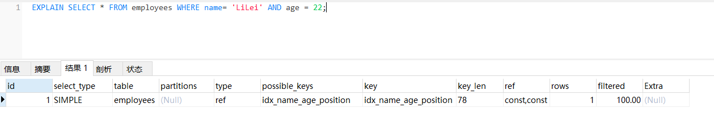


### 2.最左前缀法则
如果索引了多列，要遵守最左前缀法则。指的是查询从索引的最左前列开始并且不跳过索引中的列。

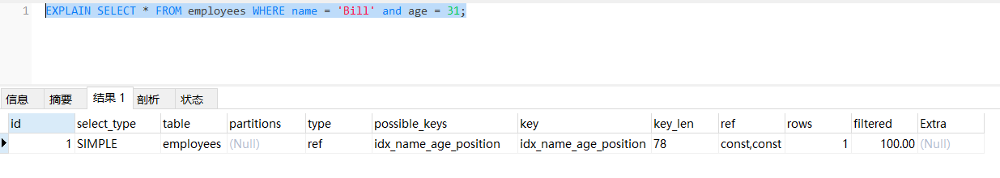

下面这个查询就不符合最左前缀法则：
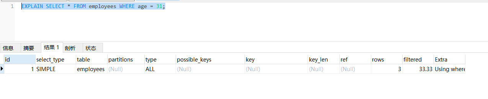

注意看下面这个写法
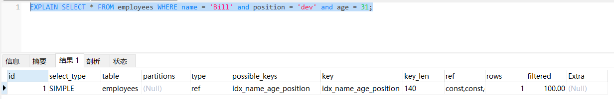

这是因为MySQL进行了优化，所以也走了索引，日常开发中要注意SQL语句的规范。

### 3.不在索引列上做任何操作（计算、函数、（自动or手动）类型转换），会导致索引失效而转向全表扫描
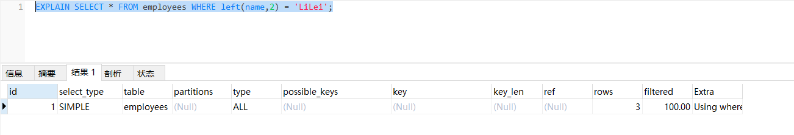

### 4.日期类字段如果有索引，使用范围查询有可能会走索引
```sql
ALTER TABLE `employees` ADD INDEX `idx_hire_time` (`hire_time`) USING BTREE ;
```

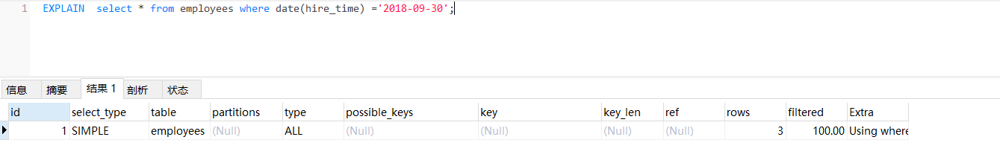

使用范围查询：
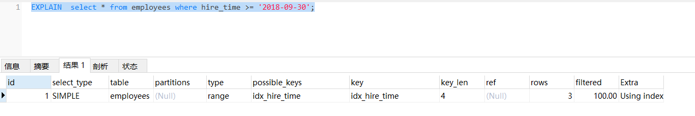


### 5.存储引擎不能使用索引中范围条件右边的列

在MySQL中，当你在多个列上创建一个联合索引时，索引的顺序是非常重要的。索引中的列顺序决定了哪些查询可以有效地使用索引。

当你在查询中使用范围条件时（比如使用BETWEEN、<、>等操作符），索引只能在范围条件的列上起作用，而不能在其右边的列上起作用。这是因为一旦MySQL在索引中找到了满足范围条件的第一个值，它就必须扫描索引中的所有后续值，直到找到不满足范围条件的值。

例如，假设你有一个在列a和b上的联合索引，你的查询是WHERE a = 1 AND b > 2。在这种情况下，索引可以在列a和b上起作用，因为a是一个常数条件，b是一个范围条件。但是，如果你的查询是WHERE a > 1 AND b = 2，那么索引只能在列a上起作用，因为a是一个范围条件，而b在其右边。

所以，当你在设计索引和查询时，你需要考虑你的查询中的条件。如果可能，你应该尽量将范围条件放在联合索引的最右边，这样可以使索引在更多的列上起作用。
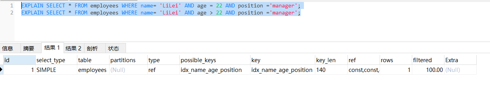

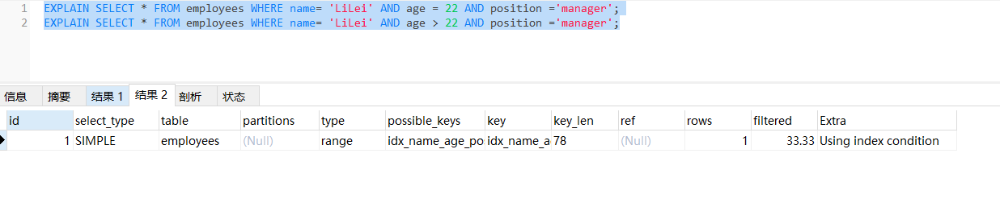

### 6.尽量使用覆盖索引
即只使用索引的查询（索引列包含查询的列），禁止或减少 select * 语句。


### 7.尽量避免使用那些无法有效利用索引的操作符


MySQL的索引是基于B-Tree（平衡多路查找树）或者Hash（哈希）等数据结构实现的。这些数据结构在处理等值查询（=）和范围查询（<、>、<=、>=）时非常高效，因为它们可以快速定位到满足条件的数据。然而，对于不等于（!=或<>）、NOT IN和NOT EXISTS等查询，索引就无法高效地工作了。

不等于（!=或<>）：当你使用不等于操作符时，满足条件的数据可能分布在整个表中，MySQL无法通过索引快速定位到这些数据，因此它需要扫描整个表。
NOT IN和NOT EXISTS：这两种操作符的情况与不等于操作符类似。它们都是在查找不满足某个条件的数据，这些数据可能分布在整个表中，因此MySQL需要扫描整个表。

对于<、>、<=、>=这些操作符，MySQL的查询优化器会根据表的大小、数据的分布、查询的选择性等因素来决定是否使用索引。如果使用索引能够显著减少需要访问的数据量，那么MySQL就会选择使用索引；否则，它可能会选择全表扫描。

总的来说，当你在设计数据库和查询时，你需要考虑这些因素，尽量避免使用那些无法有效利用索引的操作符。如果必须使用这些操作符，你可能需要考虑其他的优化策略，比如改变表的结构，或者使用其他的查询方法。

### 8.尽量不使用 is null,is not null 

is null,is not null  一般情况下也无法使用索引

### 9.避免 like以通配符开头（'$abc...'）

like以通配符开头（'$abc...'） MySQL索引失效会变成全表扫描操作

如果要使用 like '%abc%' 可以考虑全文索引（FULLTEXT），或者其他搜索引擎如Elasticsearch。


### 10.字符串不加单引号索引失效

因为发生了转换
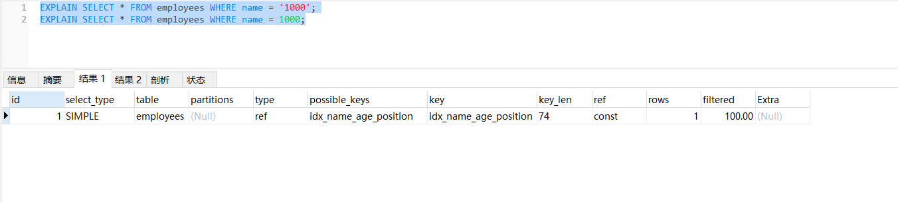
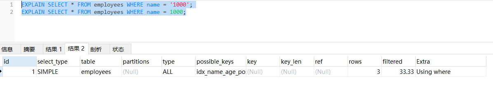

### 11.少用or或in

用它查询时，MySQL不一定使用索引，MySQL内部优化器会根据检索比例、表大小等多个因素整体评估是否使用索引，详见范围查询优化


### 12.范围查询优化

1. 考虑增加索引
2. 查询时可以将大的范围拆分成多个小范围


