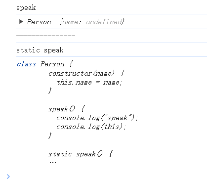

+++
title = 'Javascript ES6 Class 深入浅出'
date = 2024-05-22T01:29:33Z
draft = false
+++

## 初识 Class 

Javascript 中的类基于 Prototype 创建，一般类需要大写。
下面是一个简单的 Person 类示例，constructor 是构造函数，用来给类的对象进行初始化。

```Javascript
class Person {
  constructor(name, age) {
    //this 代表实例对象，上面定义的是实例属性/方法
    this.name = name;
    this.age = age;
  }
  // 各实例共享的方法
  sayHi() {
    console.log("sayHi");
  }
}

let zs = new Person("zhangsan", 18);
zs.sayHi();

```

上面的 Person 类等同于下面 Prototype-based 写法
```Javascript
function Person(name, age) {
  this.name = name;
  this.age = age;
}

Person.prototype.sayHi = function () {
  console.log("Prototype-based");
};

let zs = new Person("zhangsan", 18);
zs.sayHi();

```

### 立即执行的匿名类

```Javascript
new (class {
  constructor() {
    console.log("constructor");
  }
})();
```


## 类的属性和方法

### 概述
还是以上面的 Person 类为例 
name、age 字段属于 Person 的属性
sayHi 为 Person 的方法，即方法就是值为函数的特殊属性

```Javascript 
class Person {
  constructor(name, age) {
    //this 代表实例对象，上面定义的是实例属性/方法
    this.name = name;
    this.age = age;
  }
  // 各实例共享的方法
  sayHi() {
    console.log("sayHi");
  }
}
```

### 类的静态方法

类的静态方法不需要实例化就可以调用，this 指向类本身。

实例对象 this 指向自己。

```Javascript
class Person {
  constructor(name) {
    this.name = name;
  }

  speak() {
    console.log("speak");
    console.log(this);
  }

  static speak() {
    console.log("static speak");

    console.log(this); // this 指向类
  }
}

let p = new Person();
p.speak();
console.log("---------------");
Person.speak();
```


## 私有属性和方法

顾名思义，不允许外部访问的变量和方法
```Javascript 
class Person {
  #name;
  constructor(name) {
    this.#name = name;
  }
  get personName() {
    return this.#name;
  }
  set personName(newName) {
    this.#name = newName;
  }

  #privateMethod() {
    return 42;
  }

  publicMethod() {
    return this.#privateMethod();
  }
}
let p = new Person("lisi");
console.log(p.personName);
p.personName = "new name";
console.log(p.personName);
// p.#name //Uncaught SyntaxError: Private field '#name' must be declared in an enclosing class

console.log(p.publicMethod());


```

## Class 继承 

1. 实例化子类时，super 可以调用父类的构造方法
2. 子类与父类方法重名时，子类方法覆盖父类方法
3. 定义子类时可以通过 super 调用父类的方法


```Javascript
class Person {
  constructor(name) {
    this.name = name;

    console.log("Person this ", this);//实例化 Student 时，指向 Student 
  }

  static staticSpeak() {
    console.log("static speak");
  }

  publicSpeak() {
    console.log("publicSpeak");
    
  }

  #privateSpeak() {
    console.log("privateSpeak");
  }

  callPrivateSpeak(){
    this.#privateSpeak()
  }
}

class Student extends Person {
  constructor(name, age) {
    super(name);
    this.age = age;

    console.log("Student this ", this);
  }
}

let s = new Student("zhangsan",19);
s.publicSpeak()
s.callPrivateSpeak()
Student.staticSpeak()
```

### 子类覆写父类方法
```Javascript
class Person {
  constructor(name) {
    this.name = name;

    console.log("Person this ", this); //实例化 Student 时，指向 Student
  }

  static staticSpeak() {
    console.log("static speak");
  }

  publicSpeak() {
    console.log("publicSpeak");
  }

  #privateSpeak() {
    console.log("privateSpeak");
  }

  callPrivateSpeak() {
    this.#privateSpeak();
  }
}

class Student extends Person {
  constructor(name, age) {
    super(name);
    this.age = age;

    console.log("Student this ", this);
  }

  publicSpeak() {
    console.log("Student publicSpeak");
  }

  #privateSpeak() {
    console.log("Student privateSpeak");
  }

  static staticSpeak() {
    console.log("Student static speak");
  }

  callPrivateSpeak() {
    this.#privateSpeak();
  }
}

let s = new Student("zhangsan", 19);
s.publicSpeak();
s.callPrivateSpeak();
Student.staticSpeak();
```

### 通过 super 调用父类方法
``` Javascript
class Student extends Person {
  ...

  publicSpeak() {
    super.publicSpeak()
    console.log("Student publicSpeak");
    
  }

 ...
}

```
