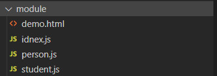
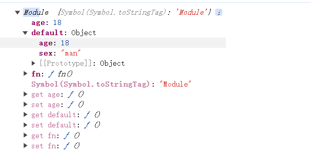

+++
title = 'Javascript Module 详解'
date = 2024-05-22T12:26:48Z
draft = false
+++

## 什么是模块(Module)

模块，在 Js 可以看成一个一个局部作用域的代码块。

我们写代码时需要注意高内聚，低耦合，这就需要用到模块系统。它能帮助我们更好的划分代码功能，增加代码复用性，便于维护程序。

引入模块系统的好处：
1. 代码模块化管理，便于复用
2. 消除过多全局变量
3. 管理加载顺序


## Module 基本用法

一个文件就是一个模块。
如下是一个基本的用法：


person.js

```javascript

class Person {
  constructor(name) {
    this.name = name;
  }
  sayHi() {
    console.log("hi");
  }
}

export default Person;


```

student.js

```javascript

import Person from "./person";

class Student extends Person {
  constructor(name, age) {
    super(name);
    this.age = age;
  }
}

export default Student;


```

index.js

```javascript

import Student from "./student";

let s = new Student("zs",10);


```

script 标签加载的时候，需要加上 type="module"
demo.html
```html
<!DOCTYPE html>
<html lang="en">
  <head>
    <meta charset="UTF-8" />
    <meta name="viewport" content="width=device-width, initial-scale=1.0" />
    <title>Document</title>
  </head>
  <body>
    <script src="./idnex.js" type="module"></script>
  </body>
</html>

```

## Module 的导出和导入

> 注意：模块没有被导出时也可以被导入，导入的作用相当于将导入的代码执行一边，也仅会执行一遍

### export default 的导出和对应 import 导入

default.js
```javascript
const age = 18;

export default age;

```

**通过 default 导出时，变量名字可以随便取**
```html
<script type="module">
  import age from './default.js'
  import age1 from './default.js'
  console.log(age)
  console.log(age1)
</script>
```

**一个文件只能有一个 export default** 
```javascript
const age = 18;
const sex = '男'
export default sex;
export default age;//A module cannot have multiple default exports

```

可以导出函数或者对象
```javascript 
export default function(){
    console.log('export default')
}

<script type="module">
  import fn from './default.js'
  fn()
  
</script>
```

```javascript 
export default {
  age: 18,
  sex: "man",
};

<script type="module">
  import obj from './default.js'
  console.log(obj)
  
</script>
```

### export 导出和对应的 import 导入

#### 基本用法 
export 导出的是声明或者语句,导入的时候需要添加括号，如下：

```javascript 

// export 声明或者语句
export const age = 18; 

// or 
const age = 18; 
export {age};
```

```html
<script type="module">
  import { age } from "./export.js";
  console.log(age);
</script>
```

**export 导入变量需要和导出一致,不能随意命名**
```html
<script type="module">
  import { age2 } from "./export.js";

  console.log(age2);
</script>
// Uncaught SyntaxError: 
The requested module './export.js' does not provide an export named 'age2'


```

#### export 多个导出

```javascript
const age = 18;
function fn() {
  console.log("export fn");
}

export { age, fn };

```

```html 

<script type="module">
  import { fn, age } from "./export.js";//导入顺序无影响
  console.log(age);
  fn();
</script>
```

#### 起别名
需要保证导入的时候和导出的名字一致即可，导入导出时均可取别名。

```javascript 

const age = 18;
function fn() {
  console.log("export fn");
}

export { age, fn as func };

```
```html

<script type="module">
  import { func, age } from "./export.js";
  console.log(age);
  func();
</script>

```

```javascript 

const age = 18;
function fn() {
  console.log("export fn");
}

export { age, fn as func };

```
```html

<script type="module">
  import { func as fn1, age } from "./export.js";
  console.log(age);
  fn1();
</script>

```


#### 整体导入

> 补充：export 跟 export default 可以同时存在，前提条件是 export default 只可以有一个

```javascript 
export const age = 18;
export function fn() {
  console.log("export fn");
}
export default {
  age: 18,
  sex: "man",
};

```

```html
<script type="module">
  import * as obj  from "./export.js";
  console.log(obj);

</script>

```
结果如下：


## 注意事项

**1. 模块中的 this 指向 undefined**

module.js
``` javascript 
console.log(this)


```

```html 
<script type="module">
  import './module.js' //undefined
</script>

```

**2. import 执行时，代码还没执行**

**3. import()可以按条件动态导入**
> 请不要滥用动态导入（只有在必要情况下采用）

```javascript

import("/modules/my-module.js").then((module) => {
  // Do something with the module.
});

let module = await import("/modules/my-module.js");
```
