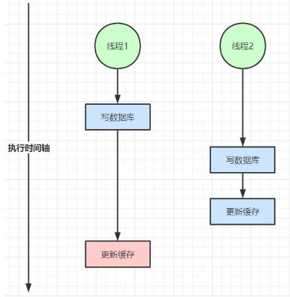
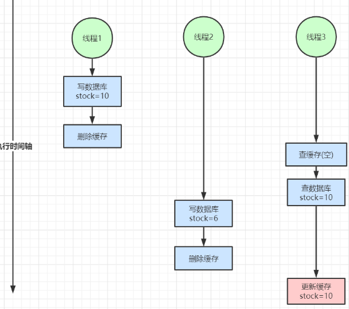

+++
title = 'Redis 缓存设计'
date = 2024-05-30T09:55:49Z
draft = false
+++

## 典型 Web 应用缓存设计架构

在一个典型的 Web 应用中，从前端请求到 Nginx 再到后端服务的多级缓存设计可以如下：

1. **浏览器缓存**：这是最接近用户的一级缓存。浏览器会根据 HTTP 的缓存控制头字段（如 Expires、Cache-Control、Last-Modified、ETag 等）来决定是否需要向服务器发送请求，还是直接从本地缓存中获取资源。

2. **CDN 缓存**：内容分发网络（CDN）是一种常见的缓存策略，它可以将内容缓存到离用户最近的节点，从而减少网络延迟。当用户的请求到达 CDN 节点时，如果节点中有缓存的内容，就直接返回给用户；如果没有，就向源服务器请求内容，并将内容缓存到节点中。

3. **Nginx 缓存**：Nginx 是一种常见的反向代理服务器，它可以将后端服务器的响应缓存起来，从而减少对后端服务器的请求。当用户的请求到达 Nginx 时，如果 Nginx 中有缓存的响应，就直接返回给用户；如果没有，就向后端服务器请求内容，并将响应缓存起来。

4. **应用服务器本地缓存**：应用服务器可以使用本地内存作为缓存，存储经常访问的数据。这样，对于相同的请求，应用服务器可以直接从本地缓存中获取数据，而不需要访问数据库或者分布式缓存。这种缓存的优点是访问速度快，但是缺点是无法在多个应用服务器之间共享数据。

5. **分布式缓存**：当数据不在应用服务器的本地缓存中时，应用服务器可以从分布式缓存（如 Redis 或 Memcached）中获取数据。分布式缓存可以在多个应用服务器之间共享数据，但是访问速度相对于本地缓存会慢一些。

6. **数据库缓存**：数据库也有自己的缓存机制，例如 MySQL 的查询缓存。当收到相同的查询请求时，数据库可以直接从缓存中返回结果，而不需要再次执行查询。

在这个过程中，每一级缓存都可以减少对下一级的访问，从而提高系统的性能。

但是，也需要注意缓存的更新和失效问题，以保证数据的一致性。

## 缓存设计

在设计缓存系统时，我们需要考虑以下几个问题：

### 缓存穿透

缓存穿透是指用户查询的数据既不在缓存中，也不在数据库中，这样的查询请求就会“穿透”缓存层，直接请求数据库。这种情况通常发生在用户查询一些不存在的数据时。

例如，假设我们有一个商品信息的系统，用户可以通过商品 ID 查询商品信息。

当用户查询一个不存在的商品 ID 时，系统首先会在缓存中查找，如果没有找到，就会去数据库中查找。但是因为这个商品 ID 不存在，所以数据库中也找不到。这样，每次查询这个商品 ID，都会直接访问数据库，而不会利用到缓存。

如果有大量这样的查询请求，就会给数据库带来很大的压力，可能导致数据库崩溃。这就是缓存穿透。

为了防止缓存穿透，常见的解决方案有：

**过滤非法请求**：在应用层增加校验，对于用户的输入进行校验，过滤掉不存在的查询。

**使用布隆过滤器**：布隆过滤器是一种数据结构，它可以用来判断一个元素是否在一个集合中。我们可以将所有可能存在的数据哈希到布隆过滤器中，当用户查询数据时，先在布隆过滤器中查找，如果布隆过滤器判断数据不存在，就直接返回，不再查询缓存和数据库。

**缓存空对象**：即使数据库中没有数据，也将“空”结果进行缓存，但是这种缓存的有效期通常设置得比较短。

### 缓存击穿

缓存击穿是指当某个热点数据的缓存过期失效的瞬间，大量的请求同时涌入，这些请求都会穿透缓存直接请求数据库，可能会导致数据库瞬间压力过大。

举个例子，假设一个电商网站的某个热销商品信息被大量用户频繁查询，这个商品信息在缓存中有对应的缓存项。

然而，当这个缓存项到达过期时间，还没有来得及被更新，此时又有大量的请求涌入查询这个商品信息，这些请求会直接打到数据库上，可能会导致数据库压力过大，甚至崩溃，这就是缓存击穿。

为了防止缓存击穿，常见的解决方案有：

1. **设置热点数据永不过期**：对于一些访问非常频繁的热点数据，可以设置其在缓存中永不过期，或者在程序中控制在缓存失效后立即重新加载。

2. **使用互斥锁**：当缓存失效的时候，不是立即去加载数据库，而是先使用缓存工具的某些带成功操作返回值的操作（比如 Redis 的 SETNX 或者 Memcached 的 ADD），当操作返回成功时，再去加载数据库，否则，就重试获取缓存。这样可以保证对于一个 key，数据库只会被加载一次。

3. **使用缓存预热策略**：缓存预热就是系统上线后，将可能被用户访问的数据主动加载到缓存中，这样用户在访问数据时，就已经在缓存中了。可以通过定时任务，在非高峰时间对可能的热点数据进行预热，加载到缓存中。

4. **设置不同的过期时间**：为了避免大量的缓存同时过期，可以为每个缓存设置不同的过期时间，比如在一个基础过期时间上加上一个随机值。

### 缓存雪崩

缓存雪崩指的是缓存层支撑不住或宕掉后， 流量会像奔逃的野牛一样， 打向后端存储层。

由于缓存层承载着大量请求， 有效地保护了存储层， 但是如果缓存层由于某些原因不能提供服务(比如超大并发过来，缓存层支撑不住，或者由于缓存设计不好，类似大量请求访问 bigkey，导致缓存能支撑的并发急剧下降)， 于是大量请求都会打到存储层， 存储层的调用量会暴增， 造成存储层也会级联宕机的情况。

预防和解决缓存雪崩问题， 可以从以下三个方面进行着手。
**保证缓存层服务高可用性**：比如使用 Redis Sentinel 或 Redis Cluster。
**依赖隔离组件为后端限流熔断并降级**：比如使用 Sentinel 或 Hystrix 限流降级组件。
可以针对不同的数据采取不同的处理方式。当业务应用访问的是非核心数据（例如电商商品属性，用户信息等）时，暂时停止从缓存中查询这些数据，而是直接返回预定义的默认降级信息、空值或是错误提示信息。

**提前演练**：在项目上线前， 演练缓存层宕掉后， 应用以及后端的负载情况以及可能出现的问题， 在此基础上做一些预案设定。

### 热点缓存 key 重建优化

开发人员使用“缓存+过期时间”的策略既可以加速数据读写， 又保证数据的定期更新， 这种模式基本能够满足绝大部分需求。

但是有两个问题如果同时出现， 可能就会对应用造成致命的危害：

1. 当前 key 是一个热点 key（例如一个热门的娱乐新闻），并发量非常大。
2. 重建缓存不能在短时间完成， 可能是一个复杂计算， 例如复杂的 SQL、 多次 IO、 多个依赖等。

在缓存失效的瞬间,有大量线程来重建缓存,造成后端负载加大,甚至可能会让应用崩溃。

要解决这个问题主要就是要**避免大量线程同时重建缓存**。
方案：利用互斥锁来解决，此方法只允许一个线程重建缓存,其他线程等待重建缓存的线程执行完，重新从缓存获取数据即可。

### 缓存与数据库双写不一致
在大并发下，同时操作数据库与缓存会存在数据不一致性问题
1. 双写不一致情况

2. 读写并发不一致

解决方案：
1. 对于并发几率很小的数据(如个人维度的订单数据、用户数据等)，这种几乎不用考虑这个问题，很少会发生缓存不一致，可以给缓存数据加上过期时间，每隔一段时间触发读的主动更新即可。

2. 并发很高，如果业务上能容忍短时间的缓存数据不一致(如商品名称，商品分类菜单等)，缓存加上过期时间依然可以解决大部分业务对于缓存的要求。

3. 延迟双删，删除缓存->更新数据库->休眠一段时间N->再删除缓存，再次删除的目的是为了防止在第一次删除缓存未更新数据库有其他线程去读取数据，并回写了缓存。这种延迟双删策略并不能完全保证数据的一致性。

4. 如果不能容忍缓存数据不一致，可以通过加分布式读写锁保证并发读写或写写的时候按顺序排好队，读读的时候相当于无锁。

5. 也可以用阿里开源的canal通过监听数据库的binlog日志及时的去修改缓存，但是引入了新的中间件，增加了系统的复杂度。

6. 写数据库后利用顺序执行的消息队列更新缓存。

## 开发规范与性能优化

### 键值设计

**key名设计**
可读性和可管理性 以业务名(或数据库名)为前缀(防止key冲突)，用冒号分隔，比如业务名:表名:id

**简洁性**
保证语义的前提下，控制key的长度，当key较多时，内存占用也不容忽视

**不要包含特殊字符**
反例：包含空格、换行、单双引号以及其他转义字符

### value设计
**拒绝bigkey(防止网卡流量、慢查询)**

**字符串类型**：它的big体现在单个value值很大，一般认为超过10KB就是bigkey。
**非字符串类型**：哈希、列表、集合、有序集合，它们的big体现在元素个数太多。

一般来说，string类型控制在10KB以内，hash、list、set、zset元素个数不要超过5000。

**非字符串的bigkey，不要使用del删除**，使用hscan、sscan、zscan方式渐进式删除，同时要注意防止bigkey过期时间自动删除问题(bigkey过期时间自动删除，会触发del操作，造成阻塞）

**bigkey的危害**：
1. 导致redis阻塞
2. 网络拥塞

**bigkey的产生**：
一般来说，bigkey的产生都是由于程序设计不当，或者对于数据规模预料不清楚造成的，来看几个例子：
1.  社交类：粉丝列表，如果某些明星或者大v不精心设计下，必是bigkey。
2.  统计类：例如按天存储某项功能或者网站的用户集合，除非没几个人用，否则必是bigkey。
3.   缓存类：将数据从数据库load出来序列化放到Redis里，这个方式非常常用，但有两个地方需要注意，第一，是不是有必要把所有字段都缓存；第二，有没有相关关联的数据，有的同学为了图方便把相关数据都存一个key下，产生bigkey。

### 如何优化bigkey

**1.拆**
big hash：可以讲数据分段存储，比如一个大的key，假设存了1百万的用户数据，可以拆分成200个key，每个key下面存放5000个用户数据

**2.分开取**
不要每次把所有元素都取出来，例如有时候仅仅需要hmget，而不是hgetall，删除也是一样，尽量使用优雅的方式来处理。

**3.选择适合的数据类型**
要合理控制和使用数据结构，但也要注意节省内存和性能之间的平衡)

**4. 合理设置过期时间**
建议使用expire设置过期时间(条件允许可以打散过期时间，防止集中过期)。

### 命令使用

####  O(N)命令关注N的数量

例如hgetall、lrange、smembers、zrange、sinter等并非不能使用，但是需要明确N的值。有遍历的需求可以使用hscan、sscan、zscan代替。

#### 禁用命令
禁止线上使用keys、flushall、flushdb等，通过redis的rename机制禁掉命令，或者使用scan的方式渐进式处理。

#### 合理使用select
redis的多数据库较弱，使用数字进行区分，很多客户端支持较差，同时多业务用多数据库实际还是单线程处理，会有干扰。

#### 使用批量操作提高效率
原生命令：例如mget、mset。
非原生命令：可以使用pipeline提高效率。

注意控制一次批量操作的元素个数(例如500以内，实际也和元素字节数有关)。

**两者不同：**
1. 原生命令是原子操作，pipeline是非原子操作。
2. pipeline可以打包不同的命令，原生命令做不到
3. pipeline需要客户端和服务端同时支持。

#### 使用 lua 脚本进行事务操作

### 客户端使用
* 避免多个应用使用一个Redis实例，不相干的业务拆分，公共数据做服务化。

* 使用带有连接池的数据库，可以有效控制连接，同时提高效率
* 高并发下建议客户端添加熔断功能(例如sentinel、hystrix)

