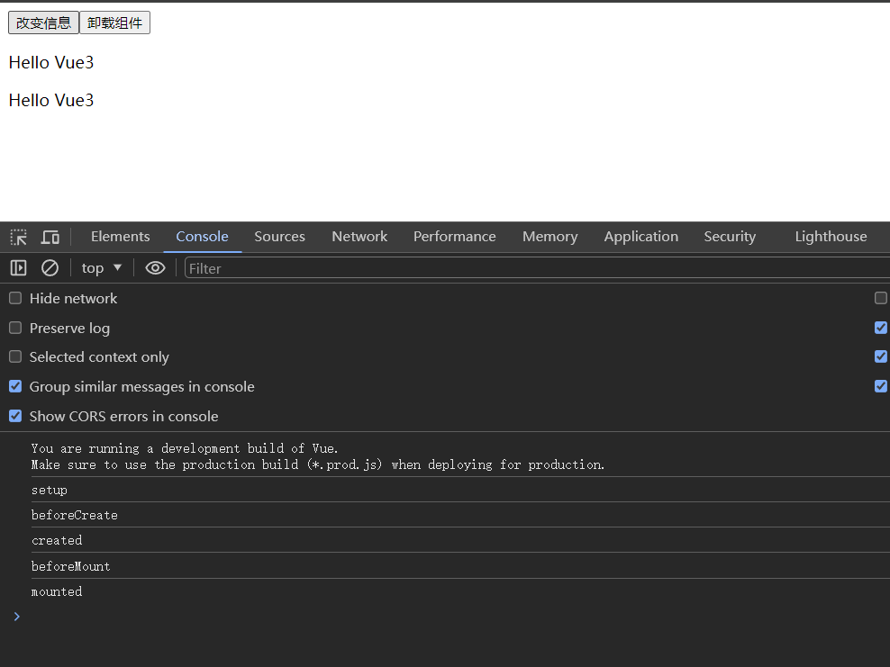
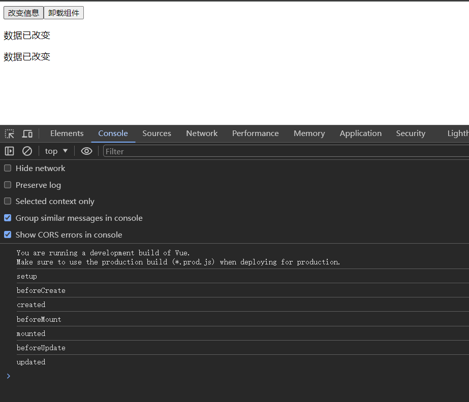
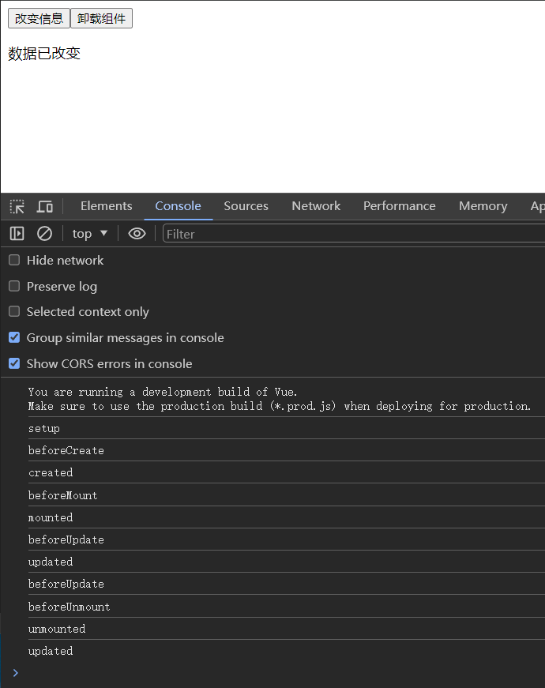

+++
title = 'VUE生命周期函数'
date = 2024-05-24T11:39:34Z
draft = false
+++

学习 VUE, 就不得不了解 VUE 的生命周期函数。
下面这张图来自 VUE [官网](https://cn.vuejs.org/guide/essentials/lifecycle.html)


其中 setup 函数是 VUE3 新加入的特性， 通过组合式 API 可以让我们的代码更具有可读性和可维护性。

我们随便写点代码来验证一下
```html
<!DOCTYPE html>
<html lang="zh">
  <head>
    <meta charset="UTF-8" />
    <meta name="viewport" content="width=device-width, initial-scale=1.0" />
    <title>VUE3 生命周期学习</title>
    <script src="https://unpkg.com/vue@3/dist/vue.global.js"></script>
  </head>

  <body>
    <div id="app">
      <button @click="changeMessage">改变信息</button>
      <button @click="unmountComponent">卸载组件</button>
      <p>{{ message }}</p>
      <child-component
        v-if="!componentUnmounted"
        :message="message"
      ></child-component>
    </div>

    <script>
      const ChildComponent = {
        props: ["message"],
        beforeUnmount() {
          console.log("beforeUnmount");
        },
        unmounted() {
          console.log("unmounted");
        },
        template: `<p>{{ message }}</p>`,
      };
      const App = {
        data() {
          return {
            message: "Hello Vue3",
            componentUnmounted: false,
          };
        },
        components: {
          "child-component": ChildComponent,
        },

        beforeCreate() {
          console.log("beforeCreate");
        },
        created() {
          console.log("created");
        },
        beforeMount() {
          console.log("beforeMount");
        },
        mounted() {
          console.log("mounted");
        },
        beforeUpdate() {
          console.log("beforeUpdate");
        },
        updated() {
          console.log("updated");
        },
        beforeUnmount() {
          console.log("beforeUnmount");
        },
        unmounted() {
          console.log("unmounted");
        },
        setup() {
          console.log("setup");
        },
        methods: {
          changeMessage() {
            this.message = "数据已改变";
          },
          unmountComponent() {
            this.componentUnmounted = true; // trigger component unmount
          },
        },
      };

      const app = Vue.createApp(App).mount("#app");
    </script>
  </body>
</html>


```

**初始化打开浏览器：**


**点击改变信息按钮：**


**点击卸载组件按钮：**
可以看到，卸载了子组件后，又重新渲染的界面。


至此，我们就对 VUE3 的生命周期有了一个直观的认识。

在编写 VUE 代码时也可以做到心中有数。