+++
title = 'Webpack 从入门到放弃'
date = 2024-05-23T08:05:20Z
draft = false
+++
## Webpack 是什么

首先，webpack 是一个打包工具，它会根据代码的内容解析模块依赖，帮助我们把多个模块的代码打包。

借助一个官网的截图，让你感受一下 webpack 的强大。

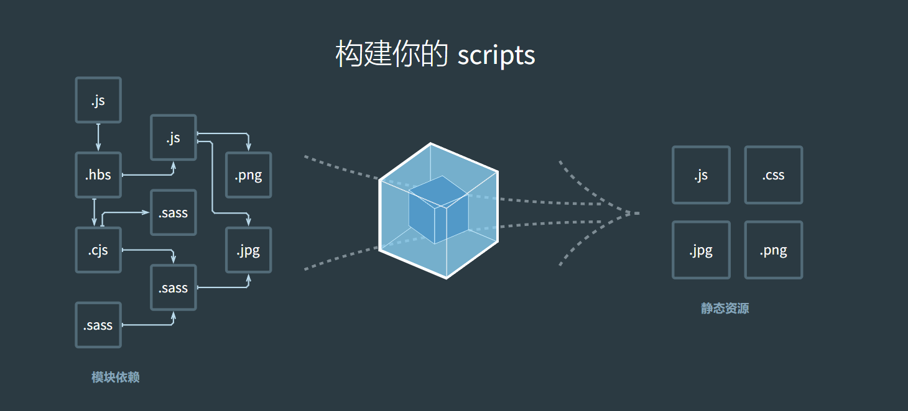


日常使用的前端开发环境应该是怎样的？我们可以尝试着把基本前端开发环境的需求列一下：
* 构建我们发布需要的 HTML、CSS、JS 文件
* 使用 CSS 预处理器来编写样式
* 使用 Babel 来支持 ES 新特性
* 本地提供静态服务以方便开发调试
* ....

这些需求，使用 webpack 都可以较好的满足。

[webpack 官方手册地址](https://webpack.docschina.org/guides/getting-started/)

## 先从一个简单的项目开始 

**1.初始化项目**
```javascript
npm init
```

**2.安装 webpack 需要的包**
```javascript
npm install --save-dev webpack-cli@3.3.12 webpack@4.44.1
```

**3.配置 webpack**

在工程文件夹内新建 webpack.config.js
```javascript
const path = require("path");

module.exports = {
  entry: "./src/index.js",
  output: {
    path: path.resolve(__dirname, "dist"),
    filename: "bundle.js",
  },
};

```
在 package.json 文件添加script命令：
```javascript
"webpack": "webpack --config webpack.config.js"
```

此时工程目录如下：
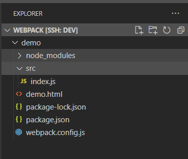

**4.编译并测试**
```javascript
npm run webpack
```

执行命令后会发现工程目录下生成了 dist/bundle.js 文件，这就是 webpack 帮我们做的事。
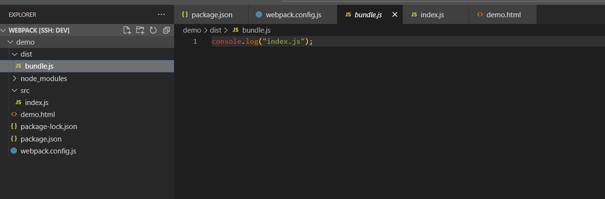


## Webpack 核心概念 

webpack 主要有四个核心概念
1. entry
2. output
3. loader
4. plugins

### entry

entry 指定入口文件，既可以指定单入口，也可以指定多入口。

多入口写法如下：
```javascript
entry: {
    button1: "./js/button1.js",
    button2: "./js/button2.js",
  },

```

### output

当有多个入口文件时，output 就需要进行相应的调整,如下：

```javascript
const path = require("path");

module.exports = {
  entry: {
    index:"./src/index.js",
    index1:"./src/index1.js",
  },
  output: {
    path: path.resolve(__dirname, "dist"),
    filename: "[name].js",
  },
};

```
执行webpack 命令
```javascript
npm run webpack

```
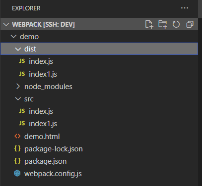


### loader

loader 让 webpack 能够去处理那些非 JS 文件的模块

下面是 webpack 结合 babel 的一个示例：

> Babel:
Babel 是一个JavaScript 编译器, 它能让开发者在开发过程中, 直接使用各类方言（如TS、Flow、JSX）或新的语法特性, 而不需要考虑运行环境, 因为Babel 可以做到按需转换为低版本支持的代码

webpack 整合 babel 需要先安装 babel 和babel-loader

```javascript
 npm install --save-dev babel-loader@8.1.0 @babel/core @babel/preset-env
```

关于babel的配置详细可以查看babel的[文档](https://www.babeljs.cn/docs/configuration)

这里指提一下本次用到的，安装完babel后需要在工程文件下新建 .babelrc 文件用来配置babel。

下面这段话来自官网的解释：
>@babel/preset-env 是一个“聪明”的预设（preset），它能让你使用最新的 JavaScript 语法而无需操心对目标环境所支持的语法设置相应的语法转换插件（以及可选的 polyfills）。这样能让你的工作更轻松，也能让打出来的 JavaScript 包更小！

.babelrc 文件 
```javascript
{
  "presets": ["@babel/preset-env"]
}

```

#### 配置 loader

loader 的配置在 module 这个对象中，如下所示：

```javascript
const path = require("path");

module.exports = {
  mode: "development",
  entry: {
    index: "./src/index.js",
  },
  output: {
    path: path.resolve(__dirname, "dist"),
    filename: "[name].js",
  },
  module: {
    rules: [
      {
        test: /\.js$/,
        exclude: /node_modules/,
        loader: "babel-loader",
      },
    ],
  },
};


```
**这里添加 mode: "development" 是便于我们测试，生产环境中不应该添加**。

我们在 index.js 中添加部分 ES6 才有的代码 
```javascript
let a = "aaaa";
const b = 1111;
console.log(a, b);

const add = (x, y) => x + y;
console.log(add(1, 1));

```
运行 webpack 结果如下：
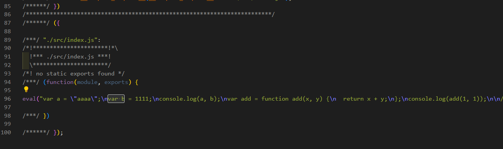

### plugins

插件 是 webpack 的支柱功能。插件目的在于解决 loader 无法实现的其他事。

webpack 有许多插件，在[webpackjs](https://www.webpackjs.com/plugins/)可以看到，可以根据项目的需要选择需要的插件
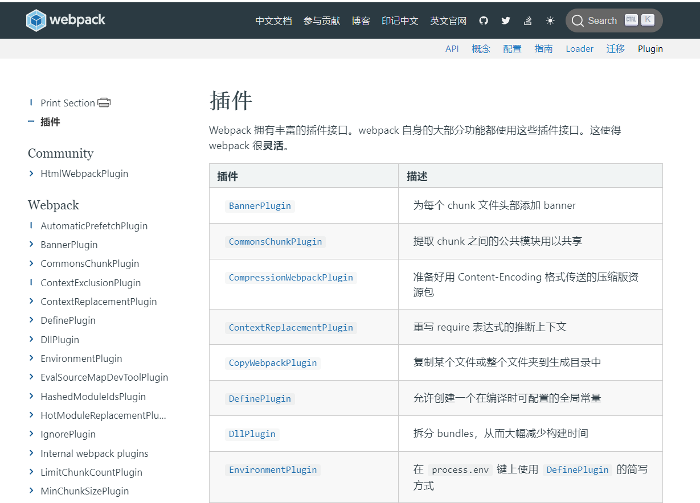

比如说：**HtmlWebpackPlugin**插件，
这个插件可以帮我们简化 HTML 文件的创建。

```javascript
npm install --save-dev html-webpack-plugin@4.3.0

```

配置插件
```javascript
const path = require("path");

const HtmlWebpackPlugin = require('html-webpack-plugin');


module.exports = {
  mode: "development",
  entry: {
    index: "./src/index.js",
  },
  output: {
    path: path.resolve(__dirname, "dist"),
    filename: "[name].js",
  },
  module: {
    rules: [
      {
        test: /\.js$/,
        exclude: /node_modules/,
        loader: "babel-loader",
      },
    ],
  },
  plugins: [
    new HtmlWebpackPlugin({
      template: './demo.html'
    })

  ]
};

```

执行webpack命令，生成结果如下，可以看到 dist 目录下多了 index.html，文件，这意味着后续的部署我们只需要将dist目录上传至服务器即可，无须再手动从源代码挑选我们需要的html文件。
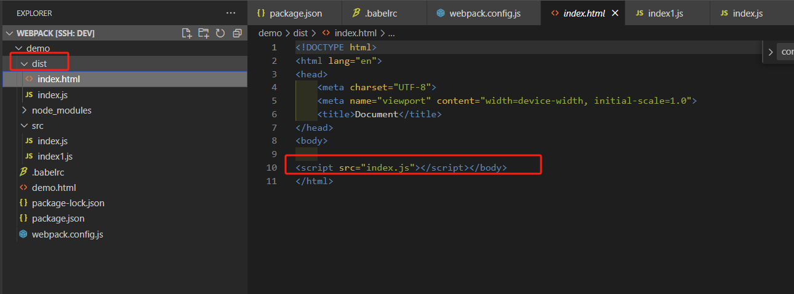

当我们需要一个插件更多的用法时，我们可以去这个插件的开源地址查看文档。

[html-webpack-plugin 地址](https://github.com/jantimon/html-webpack-plugin)

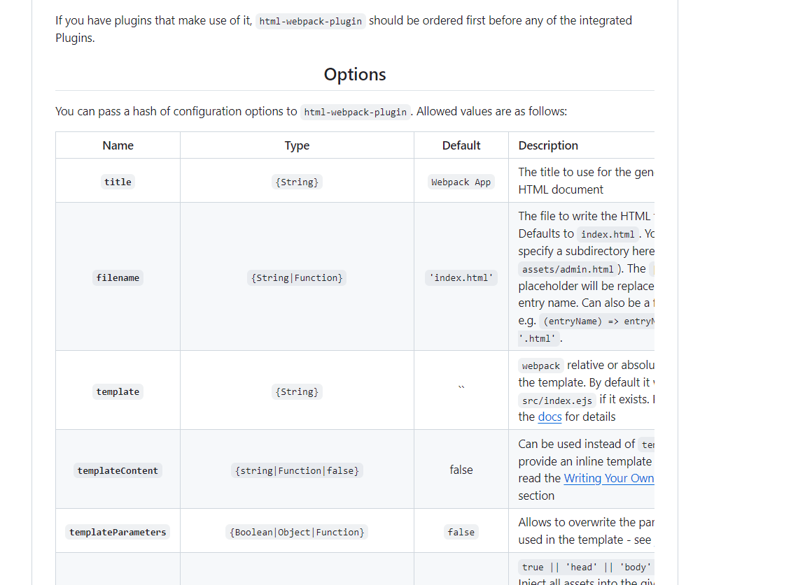


## webpack 处理 css 文件 

比如说我们有一个场景，在一个js文件中引入css文件,工程结构如下：
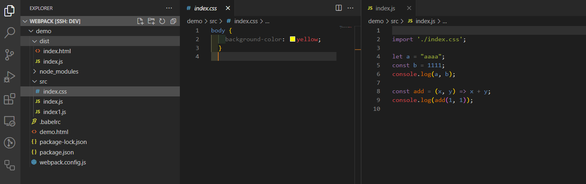

安装 css-loader
```javascript
npm install --save-dev css-loader@4.1.1 style-loader@1.2.1

```


webpack 配置如下：
```javascript
const path = require("path");

const HtmlWebpackPlugin = require("html-webpack-plugin");

module.exports = {
  mode: "development",
  entry: {
    index: "./src/index.js",
  },
  output: {
    path: path.resolve(__dirname, "dist"),
    filename: "[name].js",
  },
  module: {
    rules: [
      {
        test: /\.js$/,
        exclude: /node_modules/,
        loader: "babel-loader",
      },
      {
        test: /\.css$/,
        use:['style-loader','css-loader']
      },
    ],
  },
  plugins: [
    new HtmlWebpackPlugin({
      template: "./demo.html",
    }),
  ],
};

```
执行webpack命令,打开浏览器，可以发现页面成功展示为黄色背景 
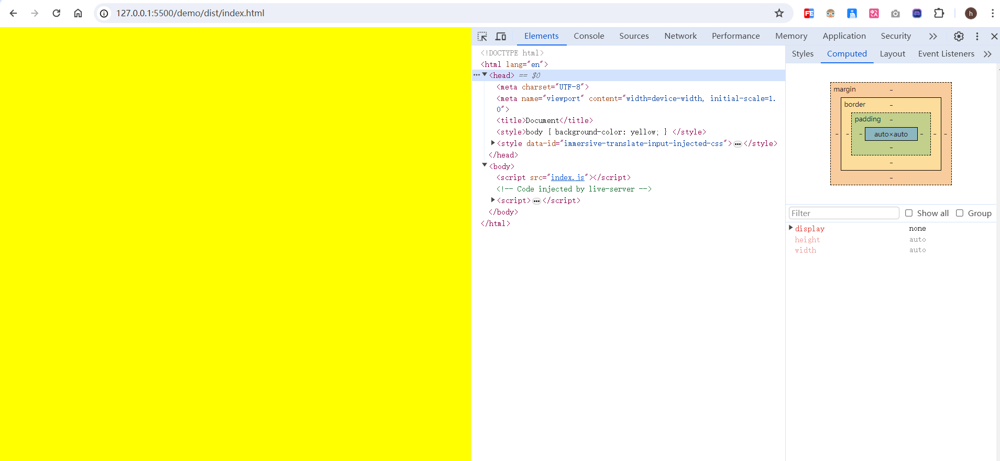

**使用 link 标签方式**

首先需要添加一个插件 

```javascript
npm install --save-dev mini-css-extract-plugin@0.9.0

```
webpack 配置如下：
```javascript
const path = require("path");

const HtmlWebpackPlugin = require("html-webpack-plugin");
const MiniCssExtractPlugin = require('mini-css-extract-plugin');


module.exports = {
  mode: "development",
  entry: {
    index: "./src/index.js",
  },
  output: {
    path: path.resolve(__dirname, "dist"),
    filename: "[name].js",
  },
  module: {
    rules: [
      {
        test: /\.js$/,
        exclude: /node_modules/,
        loader: "babel-loader",
      },
      {
        test: /\.css$/,
        use:[MiniCssExtractPlugin.loader,'css-loader']
      },
    ],
  },
  plugins: [
    new HtmlWebpackPlugin({
      template: "./demo.html",
    }),
    new MiniCssExtractPlugin({
      filename: 'css/[name].css'
    })
  ],
};


```
结果如图：
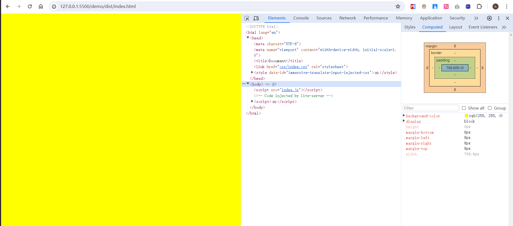


## 处理 css 文件中的图片

css 代码添加图片
```css
body {
    /* background-color: yellow; */
    background-image: url(img/image.png);
    background-repeat: no-repeat;
  }
  

```
安装 file-loader

```javascript
npm install --save-dev file-loader@6.0.0

```

webpack 配置：
```javascript
const path = require("path");

const HtmlWebpackPlugin = require("html-webpack-plugin");
const MiniCssExtractPlugin = require("mini-css-extract-plugin");

module.exports = {
  mode: "development",
  entry: {
    index: "./src/index.js",
  },
  output: {
    path: path.resolve(__dirname, "dist"),
    filename: "[name].js",
  },
  module: {
    rules: [
      {
        test: /\.js$/,
        exclude: /node_modules/,
        loader: "babel-loader",
      },
      {
        test: /\.css$/,
        use: [
          {
            loader: MiniCssExtractPlugin.loader,
            options: {
              publicPath: "../",
            },
          },
          "css-loader",
        ],
      },
      {
        test: /\.(jpg|png|gif)$/,
        use: {
          loader: "file-loader",
          options: {
            name: "img/[name].[ext]",
          },
        },
      },
    ],
  },
  plugins: [
    new HtmlWebpackPlugin({
      template: "./demo.html",
    }),
    new MiniCssExtractPlugin({
      filename: "css/[name].css",
    }),
  ],
};


```
这个部分是我们新增的
```
      {
        test: /\.(jpg|png|gif)$/,
        use: {
          loader: "file-loader",
          options: {
            name: "img/[name].[ext]",
          },
        },
      },
```
这个部分我们进行了调整，因为 dist 目录中 img 跟 css 是同级文件夹。
```javascript
{
        test: /\.css$/,
        use: [
          {
            loader: MiniCssExtractPlugin.loader,
            options: {
              publicPath: "../",
            },
          },
          "css-loader",
        ],
      },

```
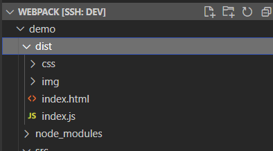


结果如下：
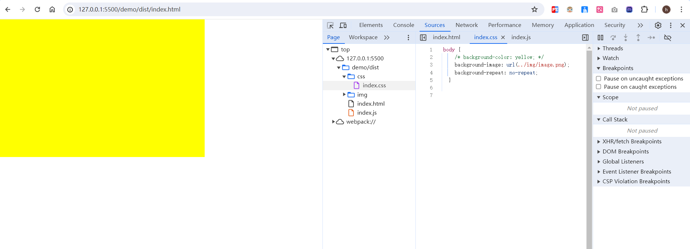


## 使用 file-loader 处理js中的图片
前面提到了 file-loader 处理 css 中的图片, 顺便提提 file-loader 如何处理 js 中的图片

调整 css 中的代码为：
```css
body {
    background-color: blue;
    /* background-image: url(img/image.png);
    background-repeat: no-repeat; */
  }
```
js 代码添加：
```javascript
import img from './img/image.png'

console.log(img)

```

结果如下：


这里输出的路径是根据 webpack 中 file-loader 配置得出的
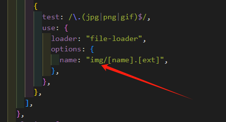

我们在 js 中添加一些操作 dom 节点代码，让结果更清晰一些，调整代码后如下：
```javascript

import './index.css';
import img from './img/image.png'

console.log(img)

const el = document.createElement('img')
el.src = img 
document.body.append(el)

```

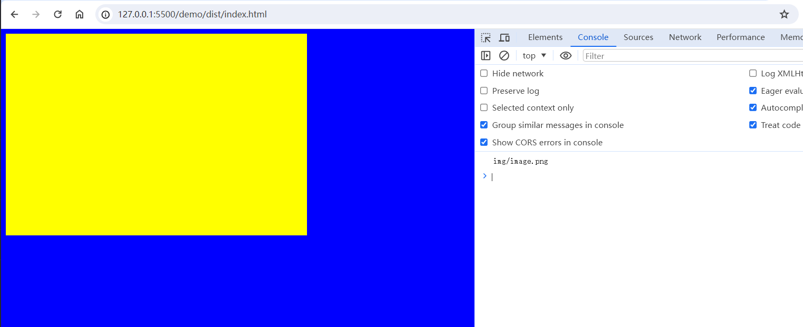


## 处理 html 中的图片

移除 js 中的代码 
```javascript
// import img from './img/image.png'

// console.log(img)

// const el = document.createElement('img')
// el.src = img 
// document.body.append(el)

```

html 代码调整如下：
```html
<!DOCTYPE html>
<html lang="en">
<head>
    <meta charset="UTF-8">
    <meta name="viewport" content="width=device-width, initial-scale=1.0">
    <title>Document</title>
</head>
<body>
    
</body>
</html>

```

我们需要引入新的 loader 
```javascript
npm install --save-dev html-withimg-loader@0.1.16

```

配置 loader 
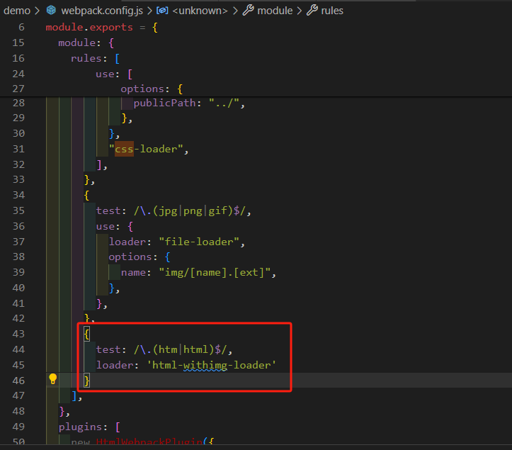


执行webpack命令,发现生成的 html 中 img 的路径是存在问题的，
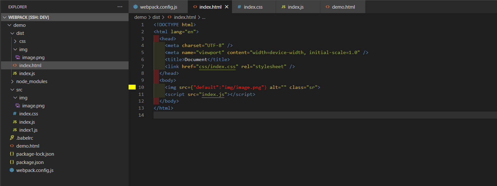

这是因为 html-withimg-loader 只是用来解析 html，具体解析图片的工作还是 file-loader 进行处理，这种情况的出现时因为 file-loader 默认是按照 es6 模块导出，即 export default 这种方式。

所以我们需要在 webpack file-loader 配置中关闭这个特性。
如下：
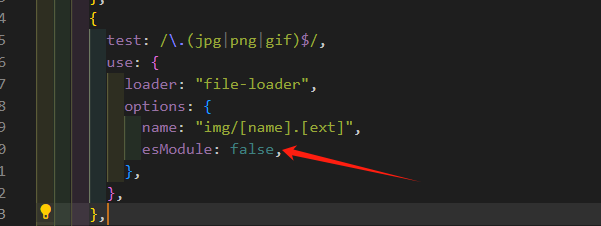

当前项目完整配置如下:
```javascript
const path = require("path");

const HtmlWebpackPlugin = require("html-webpack-plugin");
const MiniCssExtractPlugin = require("mini-css-extract-plugin");

module.exports = {
  mode: "development",
  entry: {
    index: "./src/index.js",
  },
  output: {
    path: path.resolve(__dirname, "dist"),
    filename: "[name].js",
  },
  module: {
    rules: [
      {
        test: /\.js$/,
        exclude: /node_modules/,
        loader: "babel-loader",
      },
      {
        test: /\.css$/,
        use: [
          {
            loader: MiniCssExtractPlugin.loader,
            options: {
              publicPath: "../",
            },
          },
          "css-loader",
        ],
      },
      {
        test: /\.(jpg|png|gif)$/,
        use: {
          loader: "file-loader",
          options: {
            name: "img/[name].[ext]",
            esModule: false,
          },
        },
      },
      {
        test: /\.(htm|html)$/,
        loader: "html-withimg-loader",
      },
    ],
  },
  plugins: [
    new HtmlWebpackPlugin({
      template: "./demo.html",
    }),
    new MiniCssExtractPlugin({
      filename: "css/[name].css",
    }),
  ],
};


```
再次执行，已经可以正常工作了
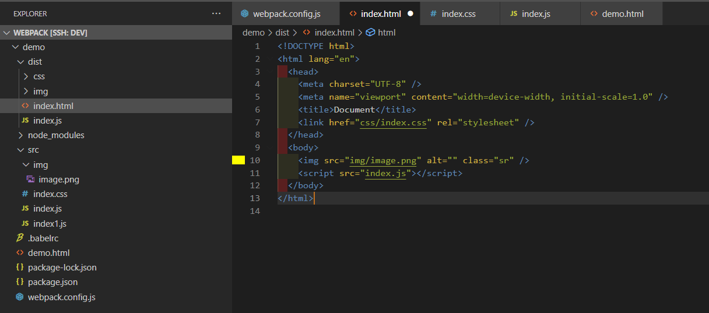
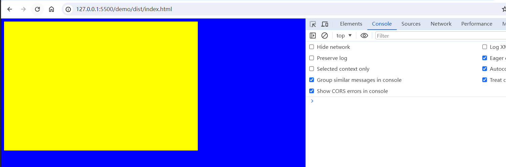

## 使用 url-loader 处理图片

url-loader 的功能比 file-loader 丰富一些。
比如遇到小图片的时候， url-loader 可以将图片转为 base64编码直接嵌入代码中，从而减少了向后台的请求，在实际场景中是非常实用的。

有了 url-loader 就可以不用使用file-loader了.

安装 url-loader

```javascript
npm install --save-dev url-loader@4.1.0
```

配置 url-loader，直接将原有的file-loader改成 url-loader 即可 
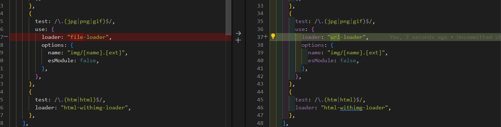

### 将图片转化 base64 图片
添加 limit 属性，这里举一个夸张的例子
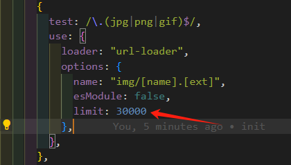
意思是小于 30000 大小的图片都会被转成 base64

我们执行一下，结果为：
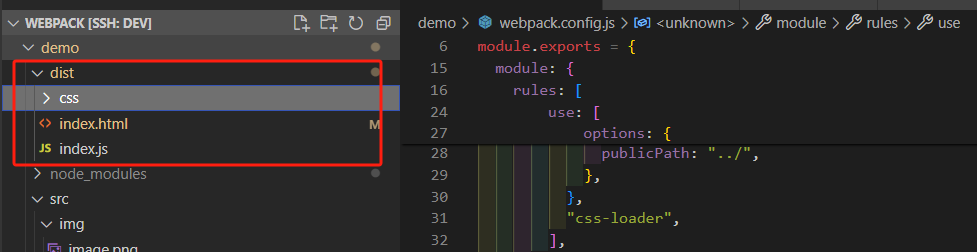
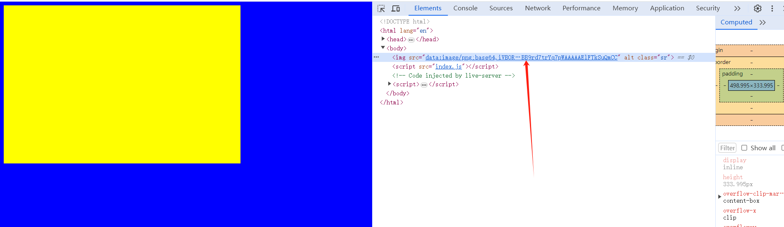
可以看到，图片被转成了base64。

## 使用 webpack-dev-server 搭建开发环境

安装 webpack-dev-server 
```javascript
npm install --save-dev webpack-dev-server@3.11.0
```

在package.json添加命令
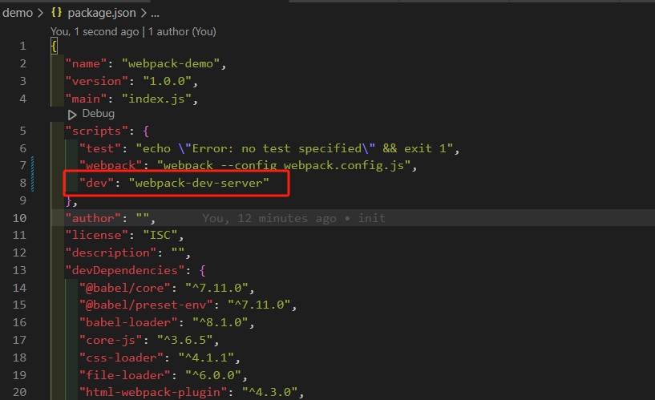

webpack中可以添加 dev-server 配置，如下：
```javascript

module.exports = {
......
  devServer: {
    compress: true,
    port: 9000,
  },
};


```
更多配置可参考[配置手册](https://www.webpackjs.com/configuration/dev-server/)

执行成功如下图：
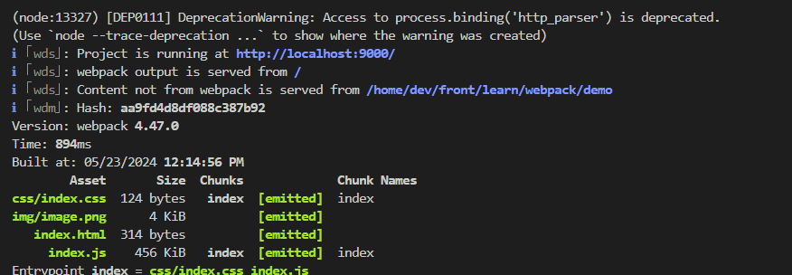

修改代码后，webpack-dev-server 会监听代码改动，从而减少手动运行，从此解放双手
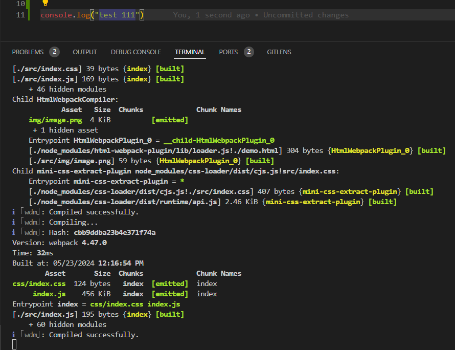
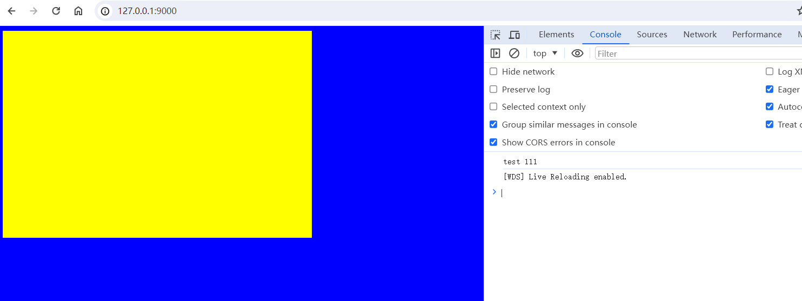
 