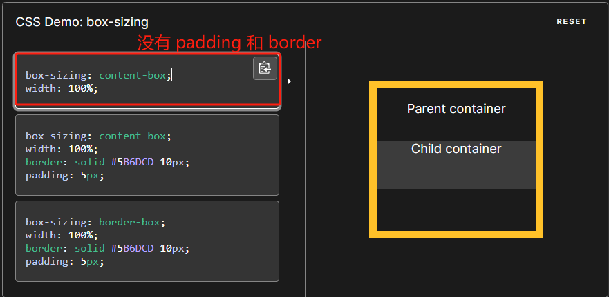
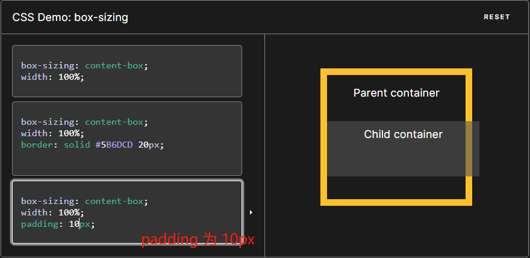
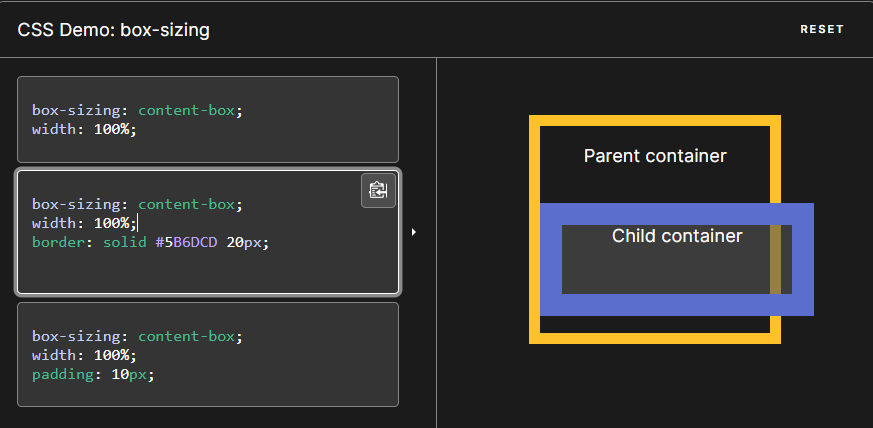
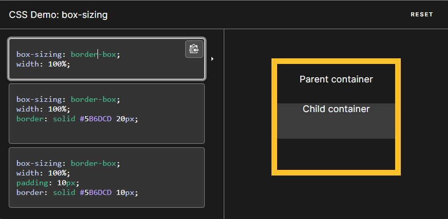
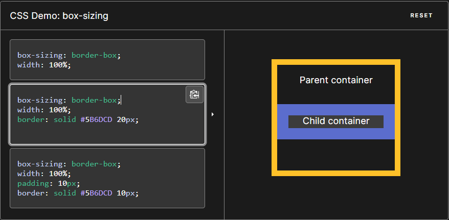
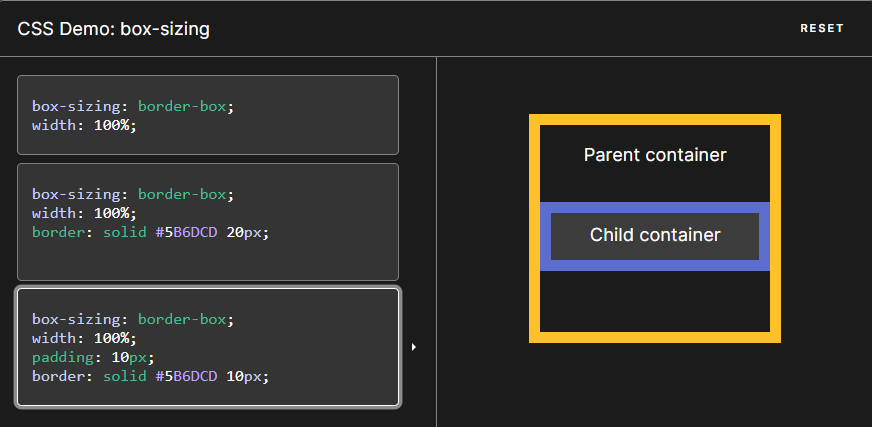
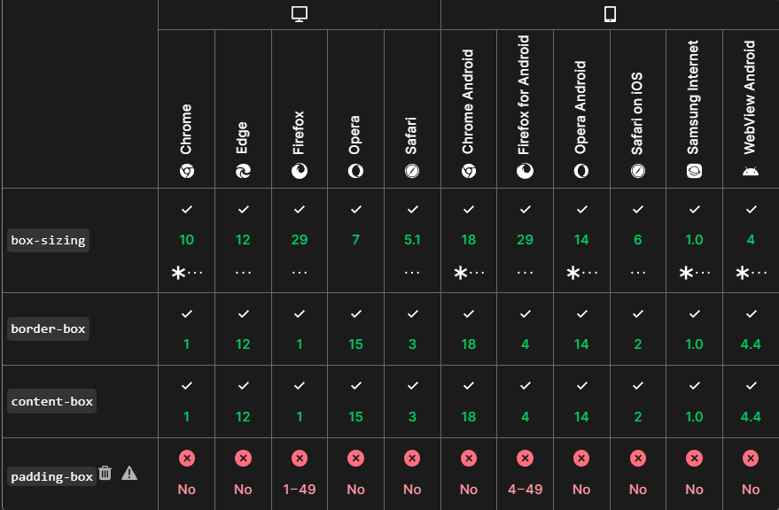

+++
title = 'Box Sizing'
date = 2024-05-24T02:53:44Z
draft = false
+++

CSS 中的 box-sizing 属性定义了 user agent 应该如何计算一个元素的总宽度和总高度。

怎么理解呢？

首先先明确一点，默认情况下，元素的宽度(width) 和高度(height)计算方式为：
> width(宽度) + padding(内边距) + border(边框) = 元素实际宽度
> height(高度) + padding(内边距) + border(边框) = 元素实际高度

而 box-sizing 属性可以被用来调整这些表现
* content-box 是默认值。如果你设置一个元素的宽为 100px，那么这个元素的内容区会有 100px 宽，并且任何边框和内边距的宽度都会被增加到最后绘制出来的元素宽度中。
* border-box ：设置的边框和内边距的值是包含在 width 内的。也就是说，如果你将一个元素的 width 设为 100px，那么这 100px 会包含它的 border 和 padding，内容区的实际宽度是 width 减去 (border + padding) 的值。大多数情况下，这使得我们更容易地设定一个元素的宽高。

我们来看下面的图：
content-box 情况：

border-box 情况：

**浏览器兼容性如下：**

参考文档[MDN box-sizing](https://developer.mozilla.org/zh-CN/docs/Web/CSS/box-sizing)