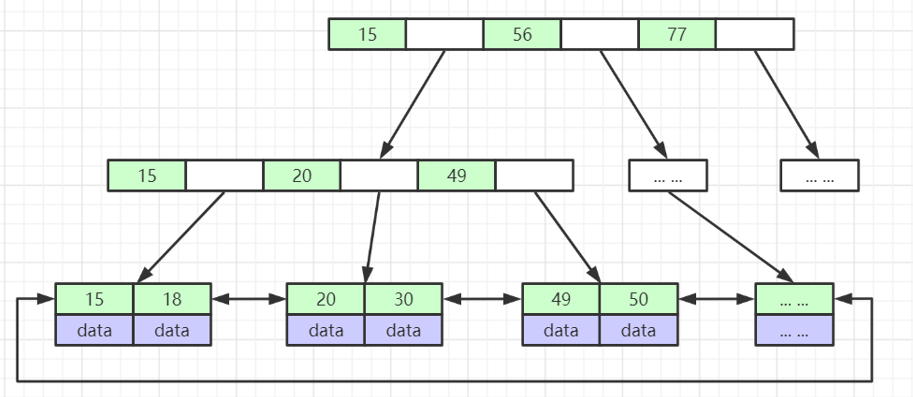

+++
title = '深入理解MySQL索引底层数据结构'
date = 2024-05-30T05:27:40Z
draft = false
+++

## 索引是什么 

索引是帮助MySQL高效获取数据的排好序的数据结构。

### InnoDB 索引实现

InnoDB 存储引擎使用一种称为 B+Tree 的数据结构来实现其索引。B+Tree 是 B-Tree 的一种变体，它在数据库索引中的应用非常广泛。

B+树是一种自平衡的树，可以保持数据有序。这种数据结构可以大大加快数据的检索速度，尤其是在处理大量数据时。

在B+树中，所有的数据都存储在叶子节点，而非叶子节点只存储关键字和子节点的指针。

同时，叶子节点之间通过指针相连，这样可以提高范围查询的效率。MySQL 对b+ 树做了优化,叶子节点之间是双向连接，标准的 b+ 树是从左指向右,单向连接 

此外，MySQL还支持哈希索引，但是哈希索引只能满足"=","IN" 和"<=>"查询，不能使用范围查询和排序，所以B+树是MySQL的主要索引结构。

InnoDB 存储引擎有两种类型的索引：主键索引（聚簇索引）和二级索引（非聚簇索引）。

#### 主键索引
InnoDB 的数据是按照主键顺序存放的，也就是说主键索引的叶子节点就是数据节点。因此，按照主键查询可以直接通过索引找到数据，效率非常高。

#### 二级索引
二级索引的叶子节点并不包含行记录的全部数据。相反，它的叶子节点包含的是对应行数据的主键值。当通过二级索引查找时，InnoDB 会先找到二级索引指向的主键，然后再通过主键索引找到完整的行数据。这就是所谓的“回表”。

### MyISAM 的索引 
MyISAM索引文件和数据文件是分离的。在MyISAM存储引擎中，每个表被存储为三个文件。一个是表定义文件（.frm），一个是数据文件（.MYD），还有一个是索引文件（.MYI）。

数据文件和索引文件是分离的，这也是MyISAM的一个特点。
数据文件存储了表的数据，而索引文件则存储了表的索引信息。这种分离的设计使得MyISAM在处理大量数据时具有一定的优势，因为索引和数据可以分别进行IO操作，提高了数据处理的效率。

但是，这种设计也有一些缺点。例如，如果在操作过程中发生故障，可能会导致数据文件和索引文件之间的不一致，从而影响数据的完整性。此外，MyISAM不支持事务，这也是其在某些场景下被InnoDB等其他存储引擎所取代的原因。

### 为什么建议InnoDB表必须建主键，并且推荐使用整型的自增主键？

InnoDB 存储引擎在存储数据时，会按照主键的顺序进行存储。

如果没有主键，InnoDB 会选择一个唯一非空索引代替，如果这样的索引也没有，InnoDB 会生成一个隐藏的聚簇索引。

这个隐藏的聚簇索引会占用额外的存储空间，而且由于它不是由用户定义的，所以在执行查询时可能会导致性能下降。

使用整型的自增主键有以下几个优点：
1. 整型的自增主键可以保证数据的插入顺序，这样可以避免页面分裂，提高插入效率
2. 整型的自增主键占用的空间小，可以减少索引的存储空间，提高查询效率。
3. 自增主键可以避免主键的重复，保证数据的唯一性。
4. 使用自增主键，可以避免在插入数据时需要手动指定主键值，简化了插入操作

### 为什么非主键索引结构叶子节点存储的是主键值？

简单来说就是为了**一致性和节省存储空间**。

在InnoDB存储引擎中，非主键索引（也称为二级索引）的叶子节点存储的是主键值，这是由InnoDB的存储结构决定的。

InnoDB使用聚簇索引（也就是主键索引）来存储数据，这意味着表中的数据实际上是按照主键的顺序存储的。因此，主键值实际上就是数据行在物理存储上的地址。

当我们通过非主键索引进行查询时，InnoDB首先会在非主键索引中查找到主键值，然后再通过主键值在聚簇索引中查找到实际的数据行。这个过程通常被称为“回表”。

这样设计的好处是，非主键索引可以更小，因为它只需要存储主键值，而不需要存储整行数据。这可以节省存储空间，提高IO效率。同时，由于所有的非主键索引都引用了主键，所以在更新数据时，只需要更新聚簇索引，而不需要更新每一个非主键索引，这也可以提高更新操作的效率。

但是，这也意味着如果频繁地进行非主键索引查询，可能会导致大量的“回表”操作，从而影响查询性能。因此，在设计数据库时，需要根据实际的查询需求来合理选择使用主键索引还是非主键索引。

### 索引最左前缀原理

最左前缀原理，也被称为最左前缀匹配原则，是指在多列索引中，查询可以只使用索引的最左边的一部分，但必须是连续的部分。这是因为多列索引是按照列的顺序，从左到右进行排序的。

例如，如果我们有一个包含三列（A，B，C）的索引，那么以下查询可以使用索引：
查询只涉及到 A 列。
查询涉及到 A 和 B 列。
查询涉及到 A，B 和 C 列。

但是，如果查询只涉及到 B 列或者 C 列，或者涉及到 A 和 C 列（跳过了 B 列），那么索引将不会被使用。这就是最左前缀原理。

这个原理的理解和应用对于数据库查询优化非常重要，因为它可以帮助我们更好地设计索引，从而提高查询效率

