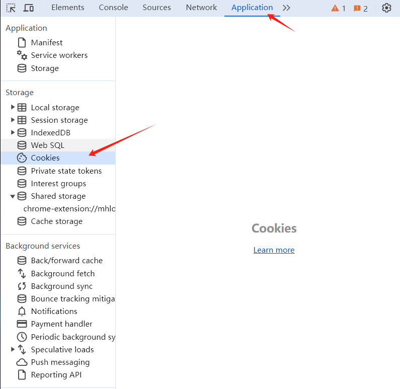
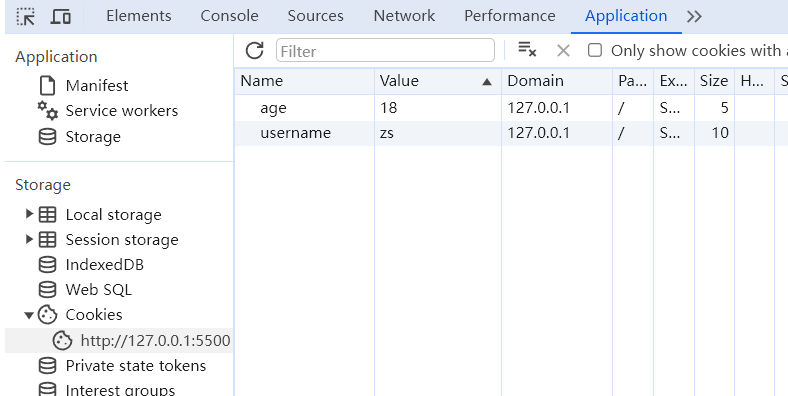
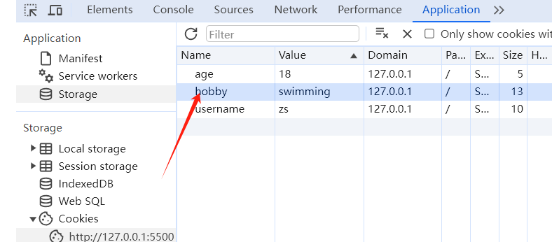
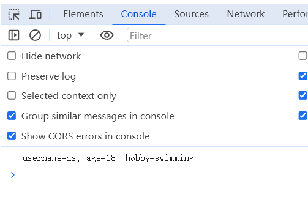
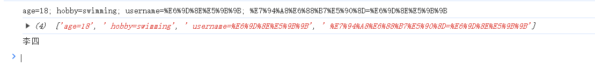
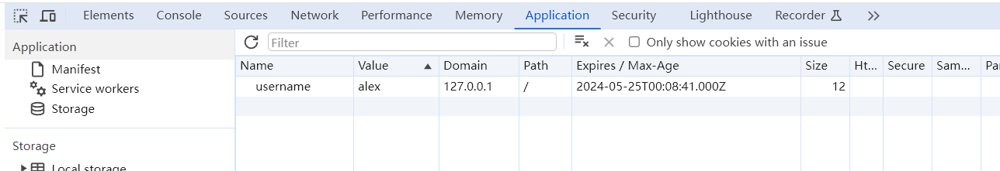

+++
title = '谈谈Cookie'
date = 2024-05-23T15:30:15Z
draft = false
+++

## Cookie 是什么
Cookie 全称 HTTP Cookie，简称 Cookie,是浏览器存储数据的一种方式。Cookie 存储在用户本地，一般会自动随着浏览器每次请求发送到服务器端。

打开浏览器开发者工具，如下：


## Cookie 有什么用 
可以利用 Cookie 跟踪统计用户访问该网站的习惯，比如什么时间访问，访问了哪些页面，在每个网页的停留时间等

> 注意：不要在 Cookie 中保存密码等敏感信息


## Cookie 的基本用法 
### 写入 Cookie 
```html
<!DOCTYPE html>
<html lang="en">
  <head>
    <meta charset="UTF-8" />
    <meta name="viewport" content="width=device-width, initial-scale=1.0" />
    <title>Document</title>
  </head>
  <body>
    <script>
      document.cookie = "username=zs";
      document.cookie = "age=18";
    </script>
  </body>
</html>


```



### 读取 Cookie 


```html
<!DOCTYPE html>
<html lang="en">
  <head>
    <meta charset="UTF-8" />
    <meta name="viewport" content="width=device-width, initial-scale=1.0" />
    <title>Document</title>
  </head>
  <body>
    <script>
      console.log(document.cookie);
    </script>
  </body>
</html>


```



## Cookie 属性 

### 最重要的两个属性
**Cookie 的名称（Name）和值（Value）** 是最重要的两个属性，创建 时必须填写，其它属性可以使用默认值。

Cookie 的名称或值如果包含非英文字母，则写入时需要使用encodeURIComponent() 编码，读取时使用 decodeURIComponent() 解码
```html
<!DOCTYPE html>
<html lang="en">
  <head>
    <meta charset="UTF-8" />
    <meta name="viewport" content="width=device-width, initial-scale=1.0" />
    <title>Document</title>
  </head>
  <body>
    <script>
      document.cookie = `username=${encodeURIComponent("李四")}`;
      document.cookie = `${encodeURIComponent("用户名")}=${encodeURIComponent(
        "李四"
      )}`;

      console.log(document.cookie);
      const kvArr = document.cookie.split(";");
      console.log(kvArr);
      kvArr.forEach((value, index) => {
        // console.log(`${index}:${value}`);
        if (index == 2) {
          const kv = value.split('=');
          console.log(decodeURIComponent(kv[1]));
        }
      });
    </script>
  </body>
</html>

```


### 失效时间

对于失效的 Cookie，会被浏览器清除,如果没有设置失效（到期）时间，这样的 Cookie 称为会话 Cookie,它存在内存中，当会话结束，也就是浏览器关闭时，Cookie 消失。

想长时间存在，需要设置 Expires 或 Max-Age
### expires

值为 Date 类型
```html
<!DOCTYPE html>
<html lang="en">
  <head>
    <meta charset="UTF-8" />
    <meta name="viewport" content="width=device-width, initial-scale=1.0" />
    <title>Document</title>
  </head>
  <body>
    <script>
      const date = new Date()
      date.setDate(date.getDate()+1)
      console.log(date)
      document.cookie = `username=alex; expires=${date}`;
    </script>
  </body>
</html>

Sat May 25 2024 00:08:43 GMT+0800 (中国标准时间)

```


### max-age
值为数字，表示当前时间 + 多少秒后过期，单位是秒

```html
<!DOCTYPE html>
<html lang="en">
  <head>
    <meta charset="UTF-8" />
    <meta name="viewport" content="width=device-width, initial-scale=1.0" />
    <title>Document</title>
  </head>
  <body>
    <script>
      document.cookie = "username=zhangsan1; max-age=5";
    </script>
  </body>
</html>


```

### Domain 域
Domain 限定了访问 Cookie 的范围。使用 JS 只能读写当前域或父域的 Cookie，无法读写其他域的 Cookie。

以下面这个为例，限定 domain 为 .ychi.site，这样 blog.ychi.site 或者 email.ychi.site 都可以访问。
```javascript
document.cookie = 'username=zhangsan; domain=.ychi.site';

```
**当前域**  blog.ychi.site 、email.ychi.site 
**父域** .ychi.site


### Path
同一个域名下,Path 限定了访问 Cookie 的范围,使用 JS 只能读写当前路径和上级路径的 Cookie，无法读写下级路径的 Cookie

比如有 
ychi.site/ 有 Cookie a=b
ychi.site/blog 有 Cookie b=c

在ychi.site 下只能访问到 a=b
在 ychi.site/blog 可以访问到 a=b b=c 


### HttpOnly
设置了 HttpOnly 属性的 Cookie 不能通过 JS 去访问


### Secure 安全标志
Secure 限定了只有在使用了 https 而不是 http 的情况下才可以发送给服务端
./